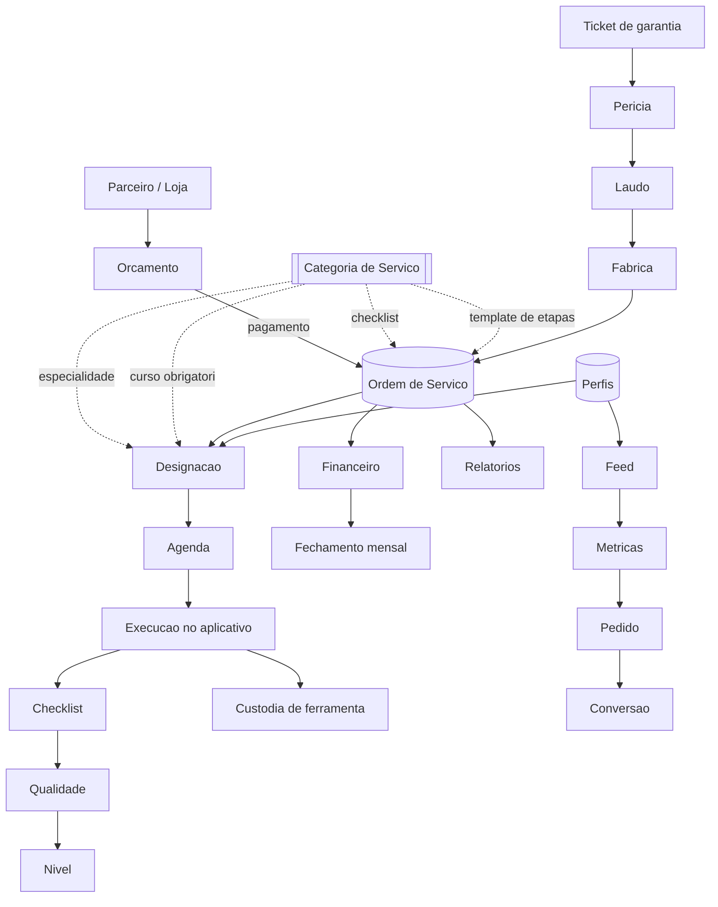
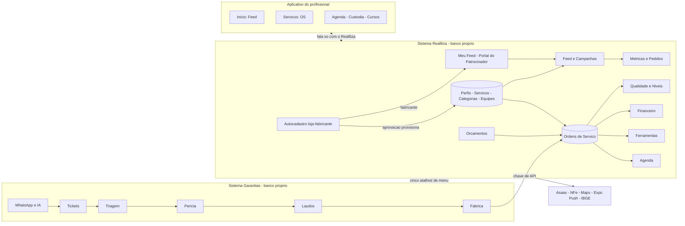

# Auditoria da Arquitetura Funcional — Ecossistema Reallliza

> Levantamento pedido por **José (proprietário)** antes de reorganizar a árvore
> de menus. O objetivo declarado por ele: *"não quero reorganizar menus apenas
> olhando os nomes das opções, porque muitas funcionalidades podem depender
> umas das outras ou fazer parte de um mesmo fluxo operacional."*
>
> **Versão 3 — 24/08/2026.** A versão 2 (17/08) refez o inventário com os dez
> atributos em cada item. Esta versão soma o que mudou numa semana de ritmo
> alto: dois itens de menu novos (**Cadastros de Empresas**, **Meu Feed** —
> este último batizando na prática o **Portal do Patrocinador**, que já
> existia mas ainda não tinha entrado no inventário), um quarto papel de
> usuário (**patrocinador**, além de admin/técnico/parceiro), a correção de
> uma ficha que estava errada (item 12, **Garantias** — não tem relação
> nenhuma com a integração por chave de API, ao contrário do que a v2 dizia),
> aprofundamento real do módulo **Ferramentas** (a v2 tratava as nove abas
> como uma linha só) e seis achados novos, um deles confirmando ao vivo — pela
> terceira vez em três semanas — a conclusão 5 desta mesma versão anterior:
> esconder item de menu não fecha a rota. Uma conta de teste com o papel mais
> novo da plataforma (patrocinador) chegou a ver os números de OS de toda a
> Reallliza pelo `/dashboard`, sem nenhum item de menu apontando pra lá.

---

## Como ler este documento

O José pediu, para cada módulo, menu, submenu ou página, **dez informações**.
Elas aparecem sempre na mesma ordem, em ficha:

| Campo | O que responde |
|---|---|
| **Finalidade** | para que a funcionalidade existe |
| **Na prática** | o que ela faz quando alguém a usa |
| **Cadastra / consulta / altera** | que informação ela produz e consome |
| **Depende de** | o que precisa existir antes dela |
| **Dependem dela** | o que quebra se ela sumir |
| **Fluxo** | a que processo maior pertence |
| **Tipo** | módulo principal · cadastro auxiliar · configuração · relatório · etapa de processo |
| **Semelhante a** | onde há redundância ou sobreposição |
| **Automação e integração** | regra de negócio ou serviço externo ligado |
| **Impacto se mexer** | o que considerar antes de mover, agrupar ou remover |

O campo **Impacto se mexer** é o que serve diretamente à reorganização de
menus, e por isso está preenchido em todos os itens — inclusive nos que não
têm impacto nenhum, onde dizer "nenhum" é a informação útil.

### Método

Tudo conferido no código e na produção, não de memória. As contagens de uso
vêm de consulta ao banco em 17/08/2026; as de estrutura, de varredura dos dois
repositórios. O anexo no fim traz os comandos para reproduzir cada número.

---

## Sumário executivo

**A plataforma são dois sistemas** com bancos separados e uma integração de
mão única: o **Garantias** (entrada por WhatsApp, tickets, triagem, perícia,
laudo, decisão da fábrica) e o **Reallliza** (execução: ordens de serviço,
equipes, agenda, ferramentas, financeiro). O aplicativo do profissional fala
só com o Reallliza.

| | Reallliza | Garantias |
|---|---|---|
| Itens de menu | **43** | **28**, sendo **5 atalhos externos** |
| Páginas | **61** no painel | **48** |
| Rotas de API | **249** em 52 pastas | **111** |
| Telas do aplicativo | **22** · 9 abas | — |
| Migrations | **76** (005–081) | — |
| Tabelas com dado | **68 de 105** | **25 de 60** |

Os números do Garantias e do aplicativo não mudaram desde a v2 (nenhum
trabalho tocou os dois nesta semana); os do Reallliza web são todos
reconferidos hoje, pelos mesmos comandos do anexo.

**Seis conclusões que importam para a reorganização** (a quinta é a mesma da
v2 — só ganhou uma terceira confirmação prática):

1. **`service_orders` é o eixo absoluto.** Mais de vinte tabelas apontam para
   ela. Qualquer agrupamento de menu que separe o que gira em torno dela
   espalha um fluxo único por vários lugares.

2. **`service_categories` é o eixo escondido.** Quatro automações leem dela —
   checklist, template de etapas, especialidade dominante e curso obrigatório.
   No menu ela aparece como cadastro auxiliar dentro de "Serviços", e é o
   segundo ponto mais crítico do sistema. **Este é o achado que mais afeta a
   reorganização.**

3. **Metade do sistema não tem dado.** 51 das 103 tabelas do Reallliza e 35 das
   60 do Garantias estão vazias. Isso é evidência de **adoção**, não de
   inutilidade — e a distinção precisa estar clara antes de alguém usar este
   documento para justificar remoções.

4. **A redundância entre os dois sistemas é estrutural, não pontual.** O
   Garantias tem cópias vazias de OS, orçamentos, serviços, cursos, ferramentas
   e pagamentos. Cinco módulos já foram resolvidos virando atalho; os demais
   continuam duplicados no código.

5. **A permissão é toda de aplicação.** Todas as rotas usam credencial de
   serviço e verificam o papel no código; a RLS só protege o acesso direto do
   aplicativo. **Reorganizar menu não muda permissão nenhuma** — quem souber a
   URL da API continua alcançando. Sem isso escrito, a reorganização passa uma
   falsa sensação de controle de acesso.

6. **A conclusão 5 já não é teórica.** Em três semanas, três rotas reais
   ficaram sem checagem de papel enquanto o item de menu correspondente já
   estava escondido — `GET /api/feed/meta`, `GET /api/service-orders` e as
   quatro rotas por trás do `/dashboard`. A última foi encontrada porque uma
   loja/fabricante recém-cadastrada viu, sem querer, os números de OS da
   Reallliza inteira — dado real vazando, não um risco hipotético. As três
   já estão corrigidas, mas o padrão se repetiu três vezes com autores e
   datas diferentes: é um risco estrutural do jeito como a autorização é
   feita hoje (checagem por rota, nunca centralizada), não um lapso pontual
   de alguém. Ver achado 7.6.

---

## 1. Auditoria Funcional — por domínio de negócio

Organizada por domínio, e não pela ordem do menu, porque a ordem atual é
justamente o que está em questão.

### 1.1 Comercial — da loja ao pedido pago

O parceiro pede um serviço, o sistema precifica, o cliente paga, e o pagamento
cria a ordem de serviço. É o único ponto onde dinheiro vira trabalho.

**Orçamentos** · **Propostas** · **Clientes** · **Serviços** · **Preços por
estado** · **Taxas de estadia**

### 1.2 Operacional — a execução

O núcleo. Ordem de serviço, designação, agenda, etapas, checklist, fotos,
assinatura e conclusão.

**Ordens de Serviço** · **Aguardando Designação** · **OSs Homologados** ·
**Agenda** · **Equipes** · **Mapa** · **Checklists** · **Templates de
Execução**

### 1.3 Rede de profissionais

Quem executa: cadastro, homologação, especialidade, nota, nível e o que cada
um pode receber.

**Usuários** · **Parceiros** · **Homologação** · **Cadastros de Empresas**
(novo, 24/08 — o mesmo papel de "quem pode entrar", só que para loja e
fabricante em vez de profissional autônomo) · **Especialidades** ·
**Qualidade** · **Níveis e Avaliação** · **Avaliações**

### 1.4 Almoxarifado

Ferramenta como ativo com custódia: catálogo, inventário por unidade, pedido,
aprovação, entrega, devolução, manutenção e baixa.

**Ferramentas** e suas nove abas internas

### 1.5 Conteúdo e capacitação

Comunicação com a rede e formação.

**Feed** · **Painel do Feed** · **Campanhas** · **Pedidos e moderação** ·
**Meu Feed / Portal do Patrocinador** (novo, já existia mas só entrou no
inventário em 24/08 — é o Feed visto pelo lado de quem paga) · **Cursos** ·
**Aprendizado** · **Notificações**

### 1.6 Financeiro e gestão

**Financeiro** · **Financeiro (loja)** · **Fechamento Mensal** ·
**Relatórios** · **Relatórios (loja)** · **BI / Dashboards** · **Dashboard**

### 1.7 Configuração e governança

**Config. Globais** · **Regiões** · **Auditoria** · **Configurações** ·
**Chats** · **Garantias**

---

## 2. Inventário — ficha de cada item

### Reallliza — os 40 itens de menu

---

#### 1. Dashboard · `/dashboard` · admin, técnico, parceiro

| | |
|---|---|
| **Finalidade** | Primeira tela depois do login; dá a situação do dia sem obrigar a abrir módulo nenhum |
| **Na prática** | Conta OS por situação, mostra a evolução do mês, os próximos agendamentos e pendências |
| **Cadastra / consulta / altera** | Só consulta. Não grava nada |
| **Depende de** | `service_orders`, `schedules`, `quotes`, `profiles` |
| **Dependem dela** | Nada. É folha |
| **Fluxo** | Nenhum — é leitura sobre todos |
| **Tipo** | Painel (relatório de leitura) |
| **Semelhante a** | **BI / Dashboards** e **Relatórios** cobrem o mesmo terreno com outro recorte. Três entradas para "ver como estamos" |
| **Automação e integração** | Nenhuma |
| **Impacto se mexer** | Baixo. Mover não quebra nada; remover tira a porta de entrada e obriga a navegar até o módulo |

---

#### 2. Feed · `/feed` · admin, técnico, parceiro

| | |
|---|---|
| **Finalidade** | Canal oficial de conteúdo e campanhas para a rede de profissionais |
| **Na prática** | Administrador cria publicação com mídia, botão de ação, enquete, categoria e público; técnico e parceiro leem, reagem, comentam, salvam, compartilham, votam e pedem amostra |
| **Cadastra / consulta / altera** | Cadastra publicação, mídia, botão, enquete, comentário, reação, salvamento, voto, pedido (lead) e evento de métrica. Consulta perfil para resolver público |
| **Depende de** | `profiles` (segmentação), `feed_categories`, `feed_audience_rules`, `feed_sponsors`, `feed_campaigns`, armazenamento de mídia |
| **Dependem dela** | **Painel do Feed**, **Campanhas** e **Pedidos e moderação** — as três leem o que este módulo produz |
| **Fluxo** | Conteúdo → segmentação → publicação → interação → métrica → lead → conversão |
| **Tipo** | Módulo principal |
| **Semelhante a** | **Notificações** (aviso pontual) e o **Feed Corporativo do Garantias**, que virou atalho para cá em 17/08 |
| **Automação e integração** | Publicação agendada, encerramento automático, fixação com prazo, resolução e recálculo de audiência, notificação em lote via Expo Push, agregação de métricas — todas em rotina periódica |
| **Impacto se mexer** | **Alto.** É a maior superfície de API do sistema (30 rotas, contra 24 de ordens de serviço). As três telas de gestão são filhas dela: separá-las no menu sem indicar o parentesco esconde a relação |

---

#### 3. Painel do Feed · `/feed/painel` · admin

| | |
|---|---|
| **Finalidade** | Desempenho de conteúdo e campanhas, no formato que o mercado de mídia usa |
| **Na prática** | Dezoito indicadores, evolução diária/semanal/mensal, horários e dias de maior acesso, mapa das 27 UFs, rankings e desempenho por campanha |
| **Cadastra / consulta / altera** | Só consulta: `feed_post_daily_metrics`, `feed_post_reach`, `feed_events` |
| **Depende de** | **Feed** (sem publicação não há o que medir) e da rotina de agregação |
| **Dependem dela** | Nada. É folha |
| **Fluxo** | Conteúdo → métrica |
| **Tipo** | Relatório |
| **Semelhante a** | **BI / Dashboards**, com recorte diferente |
| **Automação e integração** | Lê o que a agregação periódica produz; não calcula na hora |
| **Impacto se mexer** | Baixo para mover. Se a rotina periódica parar, os números congelam sem aviso na tela |

---

#### 4. Campanhas · `/feed/campanhas` · admin

| | |
|---|---|
| **Finalidade** | Guarda-chuva comercial das publicações patrocinadas: quem paga, quanto, por quanto tempo e com que meta |
| **Na prática** | Cadastra patrocinador e campanha, com período, investimento, referência de contrato e metas; mostra entregue contra contratado |
| **Cadastra / consulta / altera** | `feed_sponsors`, `feed_campaigns`. Altera situação da campanha |
| **Depende de** | **Feed** (a peça) e da agregação (o entregue) |
| **Dependem dela** | **Feed** (a publicação aponta para a campanha) e **Pedidos** (o lead herda o patrocinador) |
| **Fluxo** | Comercial de mídia: patrocinador → campanha → peça → entrega → relatório |
| **Tipo** | Módulo principal |
| **Semelhante a** | Nada no sistema. É o único lugar com noção de contrato de mídia |
| **Automação e integração** | Encerrar campanha tira as peças do ar junto — peça patrocinada rodando depois do fim do contrato é entrega não cobrada |
| **Impacto se mexer** | Médio. Remover deixa a publicação patrocinada sem a quem prestar contas |

---

#### 5. Pedidos e moderação · `/feed/leads` · admin

| | |
|---|---|
| **Finalidade** | Duas filas de trabalho: o que chegou de pedido pelos botões e o que foi denunciado no feed |
| **Na prática** | Lista os pedidos com contato e origem, permite mudar a situação até "convertido"; e a fila de comentários denunciados, agrupada por comentário |
| **Cadastra / consulta / altera** | Altera `feed_leads.status` e o estado do comentário; consulta `feed_comment_reports` |
| **Depende de** | **Feed** (o botão que gera o pedido) e **Campanhas** (a quem o lead pertence) |
| **Dependem dela** | **Painel do Feed** — "Conversões" sai daqui |
| **Fluxo** | Conteúdo → clique → pedido → contato → conversão |
| **Tipo** | Etapa de processo (fila de trabalho) |
| **Semelhante a** | **Chats** e **Notificações** também são caixas de entrada, com naturezas diferentes |
| **Automação e integração** | A data da conversão é carimbada pelo banco, não digitada; contadores da publicação acompanham por gatilho |
| **Impacto se mexer** | Médio. Sem esta tela o lead entra e ninguém trabalha — e é o único número que o patrocinador compra |

---

#### 6. Ordens de Serviço · `/os` · admin, técnico

| | |
|---|---|
| **Finalidade** | O eixo da plataforma. Todo trabalho executado é uma OS |
| **Na prática** | Cria, lista, filtra, designa, acompanha etapas, fotos, checklist, assinatura e conclusão |
| **Cadastra / consulta / altera** | `service_orders`, `service_order_items`, `os_status_history`, `os_step_executions`, `photos`, `schedules` |
| **Depende de** | `profiles`, `teams`, `services`, `service_categories`, `partners`, `quotes` |
| **Dependem dela** | **Mais de vinte tabelas.** Agenda, Ferramentas (custódia), Financeiro, Qualidade, Avaliações, Garantias, Relatórios, Fechamento Mensal e o aplicativo inteiro |
| **Fluxo** | É o centro de todos os fluxos operacionais |
| **Tipo** | Módulo principal |
| **Semelhante a** | `ordens_servico` no Garantias — tabela vazia, cópia não usada |
| **Automação e integração** | Conversão de orçamento em OS por três caminhos, designação automática de equipe, agendamento em dias contíguos, automação por categoria, bloqueio por curso obrigatório, distribuição para homologados, recálculo de nota e nível, custódia de ferramenta, roteamento de garantia |
| **Impacto se mexer** | **Máximo.** Nada aqui pode ser movido sem revisar tudo que aponta para ela. É o item que deve ancorar a nova árvore |

---

#### 7. Aguardando Designação · `/os/designacao` · admin

| | |
|---|---|
| **Finalidade** | Fila das OS que existem e ainda não têm quem execute |
| **Na prática** | Lista as OS na situação `awaiting_assignment` e permite designar equipe ou profissional |
| **Cadastra / consulta / altera** | Altera `service_orders.assigned_*` e a situação |
| **Depende de** | **Ordens de Serviço**, **Equipes** |
| **Dependem dela** | **Agenda** — a designação é o que cria o agendamento |
| **Fluxo** | OS criada → designação → agenda → execução |
| **Tipo** | Etapa de processo |
| **Semelhante a** | É um filtro de **Ordens de Serviço** promovido a item de menu |
| **Automação e integração** | A designação dispara a automação por categoria — provisiona etapas e checklist. Esta rota escapa do gatilho de mudança de situação, então a automação é chamada aqui explicitamente |
| **Impacto se mexer** | Médio. Agrupar sob Ordens de Serviço é natural; **remover a tela esconde a fila**, e 12 das 41 OS estão nesse estado |

---

#### 8. OSs Homologados · `/os/homologados` · admin

| | |
|---|---|
| **Finalidade** | Consulta separada das OS executadas pela rede homologada |
| **Na prática** | Mesma lista de OS, com filtro fixo de rede externa |
| **Cadastra / consulta / altera** | Só consulta |
| **Depende de** | **Ordens de Serviço**, **Homologação** |
| **Dependem dela** | Nada |
| **Fluxo** | Distribuição a homologados → aceite → execução → custódia → repasse |
| **Tipo** | Relatório (consulta filtrada) |
| **Semelhante a** | **Ordens de Serviço** com filtro. Terceira entrada para a mesma tabela, junto com Designação |
| **Automação e integração** | Nenhuma própria |
| **Impacto se mexer** | Baixo. Candidata natural a virar filtro salvo dentro de Ordens de Serviço |

---

#### 9. Orçamentos · `/orcamentos` · admin, parceiro

| | |
|---|---|
| **Finalidade** | Onde o trabalho é precificado e vendido |
| **Na prática** | Monta itens, calcula deslocamento, estadia, hora especial e taxa da plataforma; envia para pagamento |
| **Cadastra / consulta / altera** | `quotes`, `quote_items`, `payments` |
| **Depende de** | **Serviços**, **Preços por estado**, **Taxas de estadia**, **Parceiros**, geocodificação |
| **Dependem dela** | **Ordens de Serviço** — `quotes.service_order_id` é o **único elo** entre o comercial e o operacional |
| **Fluxo** | Loja → orçamento → pagamento → OS |
| **Tipo** | Módulo principal |
| **Semelhante a** | **Propostas** (proposta a homologados) e `orcamentos` no Garantias, vazia |
| **Automação e integração** | Precificação com geocodificação em cascata; cobrança e webhook Asaas; **três caminhos convergem na conversão em OS** — webhook, pagamento sem gateway e confirmação manual |
| **Impacto se mexer** | **Alto.** É a fronteira entre vender e executar |

---

#### 10. Clientes · `/clientes` · parceiro

| | |
|---|---|
| **Finalidade** | Lista de clientes da loja parceira |
| **Na prática** | Só leitura — a lista é derivada dos orçamentos, não há cadastro próprio |
| **Cadastra / consulta / altera** | Nada. Consulta `quotes` agrupado por cliente |
| **Depende de** | **Orçamentos** |
| **Dependem dela** | Nada |
| **Fluxo** | Comercial |
| **Tipo** | Relatório |
| **Semelhante a** | É uma visão de **Orçamentos** |
| **Automação e integração** | Nenhuma |
| **Impacto se mexer** | Nenhum. Remover não perde dado — a origem continua em Orçamentos |

---

#### 11. Propostas · `/propostas` · admin

| | |
|---|---|
| **Finalidade** | Distribuir trabalho à rede homologada e deixar o primeiro aceite levar |
| **Na prática** | Cria a proposta, dispara para os homologados do estado, registra o aceite |
| **Cadastra / consulta / altera** | `service_proposals` |
| **Depende de** | **Homologação**, **Ordens de Serviço**, `profiles.uf` |
| **Dependem dela** | **OSs Homologados** |
| **Fluxo** | Proposta → distribuição por UF → primeiro aceite → execução → custódia → repasse |
| **Tipo** | Etapa de processo |
| **Semelhante a** | **Orçamentos** — os dois vendem trabalho, para públicos diferentes |
| **Automação e integração** | Distribuição por UF; o primeiro aceite fecha para os demais |
| **Impacto se mexer** | Médio. Depende de UF preenchida no perfil — hoje só 5 dos 22 têm |

---

#### 12. Garantias · `/garantias` · admin, técnico, parceiro

> **Correção de 24/08 — a ficha da v2 estava errada.** Conferindo o código de
> novo (não achou nenhum `fetch` externo, nenhuma leitura de `api_keys` em
> `garantias/` nem em `api/warranties/`), este módulo **não tem relação
> nenhuma** com a integração por chave de API — essa é outra porta
> (`/api/external/service-orders`, item que cria Ordem de Serviço a partir do
> sistema Garantias). Os dois só compartilham o nome. `/garantias` é uma
> reclamação de pós-venda 100% interna do Reallliza: a loja abre garantia
> sobre uma OS que **o próprio Reallliza já concluiu**, não sobre um ticket do
> outro sistema. A confusão importa porque a v2 já a usou para justificar um
> "impacto se mexer" errado — abaixo, corrigido.

| | |
|---|---|
| **Finalidade** | A loja parceira formaliza reclamação de garantia sobre uma OS que o Reallliza já concluiu, com foto/vídeo, para reavaliação e eventual OS de assistência |
| **Na prática** | Loja/homologado abrem garantia escolhendo uma OS concluída; admin lista e filtra por situação. A metade "resolver" já tem rota pronta (`PATCH`, muda status, grava parecer, linka a OS de assistência) mas **nenhum botão a chama** — hoje só dá pra listar e apagar |
| **Cadastra / consulta / altera** | `warranties` (ainda pouco usada, mas deixou de estar vazia — ver contagem geral) |
| **Depende de** | **Ordens de Serviço** (a garantia só existe sobre uma OS concluída), **Orçamentos** (popula o seletor de OS de origem), **Parceiros** |
| **Dependem dela** | **Dashboard** (cards "Garantias Abertas/Concluídas"), **BI** (taxa de garantia), **Fechamento Mensal** (contagem do mês). Nenhuma delas quebra sem dado — todas já tratam ausência com `?? 0` |
| **Fluxo** | OS concluída → [opcional] loja abre garantia → Reallliza avalia → [opcional] gera OS de assistência (hoje só via chamada direta à API, sem botão) |
| **Tipo** | Etapa de um processo maior (pós-venda), não configuração/governança — **reclassificar**: a v2 agrupava este item em 1.7 "Configuração e governança", mas o próprio menu já o coloca no bloco operacional da loja, entre Propostas e Relatórios |
| **Semelhante a** | Nome duplicado com o sistema Garantias externo — é a maior fonte de confusão do inventário inteiro, e a v2 chegou a herdar essa confusão numa ficha oficial |
| **Automação e integração** | Roteamento automático pro homologado que executou a OS original, com notificação de prioridade alta. **Nenhuma** integração externa — bucket de evidências é **público** (qualquer um com a URL acessa, sem login) |
| **Impacto se mexer** | Baixo tecnicamente — nenhuma ligação de código com o sistema Garantias externo, então mexer aqui **não** fecha porta de integração nenhuma (ao contrário do que a v2 registrava). O risco real é de produto: qualquer reorganização de menu precisa deixar claríssimo que isto não é o sistema Garantias, porque até este documento já confundiu os dois uma vez |

---

#### 13. Relatórios (loja) · `/relatorios-loja` · parceiro

| | |
|---|---|
| **Finalidade** | O que a loja parceira precisa prestar de contas |
| **Na prática** | Relatório por OS, com fotos e assinatura, exportável |
| **Cadastra / consulta / altera** | Só consulta |
| **Depende de** | **Ordens de Serviço**, **Fotos** |
| **Dependem dela** | Nada |
| **Fluxo** | Execução → prestação de contas |
| **Tipo** | Relatório |
| **Semelhante a** | **Relatórios** (admin) — mesmo conteúdo, público diferente |
| **Automação e integração** | Geração de PDF |
| **Impacto se mexer** | Baixo. Consolidar com Relatórios exige separar por papel |

---

#### 14. Financeiro (loja) · `/financeiro-loja` · parceiro

| | |
|---|---|
| **Finalidade** | O que a loja pagou e o que deve |
| **Na prática** | Lista pagamentos e faturas da loja |
| **Cadastra / consulta / altera** | Consulta `payments`, `invoices` |
| **Depende de** | **Orçamentos**, **Ordens de Serviço** |
| **Dependem dela** | Nada |
| **Fluxo** | Comercial → financeiro |
| **Tipo** | Relatório |
| **Semelhante a** | **Financeiro** (admin) |
| **Automação e integração** | Asaas |
| **Impacto se mexer** | Baixo |

---

#### 15. Chats · `/chats` · admin

| | |
|---|---|
| **Finalidade** | Conversas entre administração e profissional, por OS |
| **Na prática** | Lista as conversas e abre o histórico |
| **Cadastra / consulta / altera** | `os_messages` — **tabela vazia** |
| **Depende de** | **Ordens de Serviço** |
| **Dependem dela** | Nada |
| **Fluxo** | Execução |
| **Tipo** | Módulo principal (sem uso) |
| **Semelhante a** | **Notificações**; e o Chat do aplicativo, que é a mesma conversa pelo outro lado |
| **Automação e integração** | Tempo real por assinatura do banco |
| **Impacto se mexer** | Baixo hoje. A rota que a tela consumia não existia e foi criada em 16/08 — antes disso a lista quebrava ao abrir |

---

#### 16. Agenda · `/agenda` · admin, técnico

| | |
|---|---|
| **Finalidade** | Quando cada trabalho acontece e quem está ocupado |
| **Na prática** | Calendário por equipe e por profissional, com disponibilidade |
| **Cadastra / consulta / altera** | `schedules` |
| **Depende de** | **Ordens de Serviço**, **Equipes**, **Feriados** |
| **Dependem dela** | O aplicativo (aba Agenda) |
| **Fluxo** | Designação → agenda → execução |
| **Tipo** | Módulo principal |
| **Semelhante a** | O calendário de equipe em `/equipes/[id]/calendario` |
| **Automação e integração** | Agendamento em dias contíguos; bloqueio de dia já ocupado; feriados |
| **Impacto se mexer** | **Alto.** É onde a operação se organiza no tempo |

---

#### 17. Mapa · `/mapa` · admin

| | |
|---|---|
| **Finalidade** | Onde estão as OS e os profissionais |
| **Na prática** | Mapa com marcadores de OS e última posição conhecida |
| **Cadastra / consulta / altera** | Consulta `service_orders`, `technician_locations` |
| **Depende de** | **Ordens de Serviço**, rastreamento do aplicativo |
| **Dependem dela** | Nada |
| **Fluxo** | Execução |
| **Tipo** | Relatório |
| **Semelhante a** | O mapa do Brasil no **Painel do Feed**, com finalidade diferente |
| **Automação e integração** | Google Maps; posição enviada pelo aplicativo |
| **Impacto se mexer** | Baixo |

---

#### 18. Usuários · `/usuarios` · admin

| | |
|---|---|
| **Finalidade** | Quem tem acesso e com que papel |
| **Na prática** | Cadastra, edita, ativa e desativa; define papel |
| **Cadastra / consulta / altera** | `profiles` |
| **Depende de** | Autenticação |
| **Dependem dela** | **Tudo.** `profiles` é referenciada por praticamente todo o sistema |
| **Fluxo** | Nenhum — é base |
| **Tipo** | Cadastro auxiliar (na prática, base) |
| **Semelhante a** | **Parceiros** e **Homologação** também mexem em pessoas |
| **Automação e integração** | Criação no serviço de autenticação; consentimentos |
| **Impacto se mexer** | **Máximo.** Nada funciona sem `profiles` |

---

#### 19. Parceiros · `/parceiros` · admin

| | |
|---|---|
| **Finalidade** | As lojas que trazem trabalho |
| **Na prática** | Cadastra a empresa e vincula o usuário que a representa |
| **Cadastra / consulta / altera** | `partners` |
| **Depende de** | **Usuários** |
| **Dependem dela** | **Orçamentos**, **Ordens de Serviço**, segmentação do **Feed** |
| **Fluxo** | Comercial |
| **Tipo** | Cadastro auxiliar |
| **Semelhante a** | `feed_sponsors` — patrocinador e loja podem ser a mesma empresa em papéis diferentes |
| **Automação e integração** | Nenhuma |
| **Impacto se mexer** | Médio |

---

#### 20. Equipes · `/equipes` · admin

| | |
|---|---|
| **Finalidade** | Agrupar profissionais que trabalham juntos |
| **Na prática** | Monta a equipe, define líder, consulta o calendário dela |
| **Cadastra / consulta / altera** | `teams`, `team_members` |
| **Depende de** | **Usuários** |
| **Dependem dela** | **Agenda**, **Designação**, segmentação do **Feed** |
| **Fluxo** | Designação → agenda |
| **Tipo** | Cadastro auxiliar |
| **Semelhante a** | Nada |
| **Automação e integração** | Designação automática de equipe; disponibilidade |
| **Impacto se mexer** | Médio |

---

#### 21. Homologação · `/homologacao` · admin

| | |
|---|---|
| **Finalidade** | Aprovar o profissional externo antes de ele receber trabalho |
| **Na prática** | Analisa a solicitação, aprova ou recusa |
| **Cadastra / consulta / altera** | `homologation_requests` — **tabela vazia** |
| **Depende de** | **Usuários** |
| **Dependem dela** | **Propostas**, **OSs Homologados**, segmentação do **Feed** |
| **Fluxo** | Cadastro público → homologação → especialidade → nível → elegibilidade |
| **Tipo** | Etapa de processo |
| **Semelhante a** | **Usuários** e **Qualidade** |
| **Automação e integração** | Aprovar libera a distribuição de propostas |
| **Impacto se mexer** | Médio. Sem uso hoje, mas é o portão da rede externa |

---

#### 22. Ferramentas · `/ferramentas` · admin, técnico

> **Aprofundado em 24/08.** A v2 tratava as nove abas como uma linha só; o
> módulo carrega duas gerações de modelo de dados convivendo (a migration 053
> tratava `tool_inventory` como a própria peça física; a 058 separou TIPO
> `tool_inventory` de UNIDADE FÍSICA `tool_units`, com histórico em
> `tool_events`) e **duas das nove abas nunca foram atualizadas pra segunda
> geração** — ver achado abaixo.

| | |
|---|---|
| **Finalidade** | Ferramenta como ativo com dono e responsável, rastreado por unidade física (peças de valor) ou por saldo (itens de consumo) |
| **Na prática** | Nove abas: catálogo (o TIPO), inventário (a UNIDADE física), pedidos, custódias, devoluções, manutenção, baixas, busca e unidades (ficha/histórico de uma peça) |
| **Cadastra / consulta / altera** | `tool_inventory` (tipo), `tool_units` (unidade física), `tool_requests`, `tool_custody`, `tool_maintenance`, `tool_retirements`, `tool_events` (histórico append-only, nunca apagado) |
| **Depende de** | **Usuários**, **Ordens de Serviço** (a custódia é por OS) |
| **Dependem dela** | **Financeiro** (repasse desconta ferramenta não devolvida), **Dashboard**, **Relatórios** (custódia) |
| **Fluxo** | Cadastro do tipo → cadastro da unidade → pedido → aprovação/reserva → separação → entrega (abre custódia) → uso → devolução (fecha custódia) → [opcional] manutenção → volta ao estoque ou baixa definitiva |
| **Tipo** | Módulo principal |
| **Semelhante a** | `ferramentas` no Garantias, vazia. **Dentro do próprio módulo**: Custódias e Devoluções são a mesma tela — mesma API, mesmo componente de ação, a única diferença é um filtro de 1 linha no cliente |
| **Automação e integração** | Custódia amarrada à OS; toda edição de cadastro gera evento imutável em `tool_events`; tipo de aviso de atraso existe e **nenhuma rotina o dispara** |
| **Impacto se mexer** | Médio, mas com um bug real que qualquer reorganização deveria corrigir, não só reposicionar: **Manutenção e Baixas escrevem status no TIPO (`tool_inventory.status`), nunca na UNIDADE (`tool_units.status`)** — e pra ferramenta rastreada por unidade é `tool_units.status` que decide se ela aparece disponível pra pedido. Resultado: mandar uma furadeira específica pra manutenção ou dar baixa nela **não impede que ela continua aparecendo disponível** em Pedidos. Só funciona certo pra ferramenta rastreada por saldo. As abas `unidades` e `unidades/[id]` seguem fora da barra de abas do próprio módulo — alcançáveis só por link interno |

---

#### 23. Checklists · `/checklists` · admin, técnico

| | |
|---|---|
| **Finalidade** | O que precisa ser conferido em cada tipo de serviço |
| **Na prática** | Monta o modelo de checklist e seus itens |
| **Cadastra / consulta / altera** | `checklist_templates`, `checklists`, `specialty_checklist_items` |
| **Depende de** | **Especialidades**, **Serviços** |
| **Dependem dela** | **Ordens de Serviço** — a automação por categoria provisiona o checklist |
| **Fluxo** | Execução |
| **Tipo** | Cadastro auxiliar |
| **Semelhante a** | **Templates de Execução** — os dois definem "o que fazer" |
| **Automação e integração** | Provisionado automaticamente pela categoria de serviço |
| **Impacto se mexer** | Médio. É lido por `service_categories.checklist_template_id` |

---

#### 24. Templates de Execução · `/templates-execucao` · admin

| | |
|---|---|
| **Finalidade** | O roteiro de etapas que o profissional segue no aplicativo |
| **Na prática** | Monta grupos e etapas, com foto obrigatória e ordem |
| **Cadastra / consulta / altera** | `step_template_groups`, `step_template_items` |
| **Depende de** | **Serviços**, **Especialidades** |
| **Dependem dela** | **Ordens de Serviço**, aplicativo (telas de etapa) |
| **Fluxo** | Execução |
| **Tipo** | Cadastro auxiliar |
| **Semelhante a** | **Checklists** |
| **Automação e integração** | Provisionado por `service_categories.step_template_group_id`; **duas rotas provisionam etapas**; rascunho não pode ser vinculado a OS (trava no banco) |
| **Impacto se mexer** | Médio-alto. Mudar o template não altera OS já provisionada |

---

#### 25. Serviços · `/servicos` · admin

| | |
|---|---|
| **Finalidade** | O catálogo do que a plataforma executa e por quanto |
| **Na prática** | Cadastra serviço, preço por estado e — dentro dele — a **categoria de serviço** |
| **Cadastra / consulta / altera** | `services`, `service_categories`, `servico_precos` |
| **Depende de** | **Especialidades**, **Checklists**, **Templates**, **Cursos** |
| **Dependem dela** | **Orçamentos**, **Ordens de Serviço** e, por meio de `service_categories`, **quatro automações** |
| **Fluxo** | Comercial e operacional |
| **Tipo** | Cadastro auxiliar — **e é aqui que está o problema de arquitetura** |
| **Semelhante a** | `servicos` no Garantias, vazia |
| **Automação e integração** | `service_categories` carrega `checklist_template_id`, `step_template_group_id`, `specialty_id` e `required_course_ids[]`. Alimenta conversão de orçamento, mudança de situação, designação e bloqueio por curso |
| **Impacto se mexer** | **Alto e subestimado.** No menu parece cadastro auxiliar; é o segundo eixo do sistema. **Deve ganhar lugar próprio na nova árvore** |

---

#### 26. Regiões · `/regioes` · admin

| | |
|---|---|
| **Finalidade** | Áreas de atuação, por nome e UF |
| **Na prática** | Cadastro simples |
| **Cadastra / consulta / altera** | `regions` — **tabela vazia** |
| **Depende de** | Nada |
| **Dependem dela** | Nada hoje |
| **Fluxo** | Nenhum |
| **Tipo** | Cadastro auxiliar |
| **Semelhante a** | `profiles.operating_region` (texto livre) e `br_ufs.region` (macro-região do IBGE, usada pelo Feed). **Três noções de região convivendo** |
| **Automação e integração** | Nenhuma |
| **Impacto se mexer** | Nenhum hoje. **Mas é o caso mais claro de redundância a resolver antes de reorganizar** |

---

#### 27. Especialidades · `/especialidades` · admin

| | |
|---|---|
| **Finalidade** | O que cada profissional sabe fazer |
| **Na prática** | Cadastra a especialidade e a associa a serviços e checklists |
| **Cadastra / consulta / altera** | `specialties`, `technician_specialty_scores` |
| **Depende de** | Nada |
| **Dependem dela** | **Designação**, **Níveis**, segmentação do **Feed**, `service_categories.specialty_id` |
| **Fluxo** | Rede de profissionais |
| **Tipo** | Cadastro auxiliar |
| **Semelhante a** | `especialidades` no Garantias (7 linhas — as duas em uso, separadas) |
| **Automação e integração** | Nota por especialidade; especialidade dominante alimenta o recorte de métrica do Feed |
| **Impacto se mexer** | Médio-alto |

---

#### 28. Qualidade · `/qualidade` · admin

| | |
|---|---|
| **Finalidade** | Avaliar tecnicamente o trabalho entregue |
| **Na prática** | Formulário de avaliação por OS |
| **Cadastra / consulta / altera** | `quality_evaluations`, `quality_evaluation_scores` — **vazias** |
| **Depende de** | **Ordens de Serviço** |
| **Dependem dela** | **Níveis e Avaliação** |
| **Fluxo** | Execução → qualidade → nível |
| **Tipo** | Etapa de processo |
| **Semelhante a** | **Avaliações** e **Níveis** — **três entradas para o mesmo eixo** |
| **Automação e integração** | Alimenta o recálculo de nota |
| **Impacto se mexer** | Baixo hoje. Consolidar as três é a maior oportunidade de simplificação do menu |

---

#### 29. Níveis e Avaliação · `/niveis` · admin

| | |
|---|---|
| **Finalidade** | Regras que transformam desempenho em nível |
| **Na prática** | Configura pesos e faixas de bronze a diamante |
| **Cadastra / consulta / altera** | `level_config`, `evaluation_weights` |
| **Depende de** | **Qualidade**, **Avaliações**, **Ordens de Serviço** |
| **Dependem dela** | Elegibilidade a proposta; segmentação do **Feed** por ranking |
| **Fluxo** | Rede de profissionais |
| **Tipo** | Configuração |
| **Semelhante a** | **Qualidade**, **Avaliações** |
| **Automação e integração** | Recálculo de nota e nível. **Certificações entram no cálculo fixadas em zero** — o critério existe e nunca pontua |
| **Impacto se mexer** | Médio |

---

#### 30. Avaliações · `/avaliacoes` · admin

| | |
|---|---|
| **Finalidade** | A nota que o cliente dá |
| **Na prática** | Lista as avaliações recebidas por link público |
| **Cadastra / consulta / altera** | `professional_ratings`, `customer_ratings` |
| **Depende de** | **Ordens de Serviço** |
| **Dependem dela** | **Níveis** |
| **Fluxo** | Execução → avaliação → nível |
| **Tipo** | Relatório |
| **Semelhante a** | **Qualidade**, **Níveis** |
| **Automação e integração** | Link público por token, sem login |
| **Impacto se mexer** | Baixo |

---

#### 31. Relatórios · `/relatorios` · admin

| | |
|---|---|
| **Finalidade** | Prestação de contas e exportação |
| **Na prática** | Relatórios operacionais em PDF e planilha |
| **Cadastra / consulta / altera** | Só consulta |
| **Depende de** | **Ordens de Serviço**, **Financeiro** |
| **Dependem dela** | Nada |
| **Fluxo** | Todos |
| **Tipo** | Relatório |
| **Semelhante a** | **BI / Dashboards**, **Dashboard**, **Relatórios (loja)** |
| **Automação e integração** | Geração de PDF |
| **Impacto se mexer** | Baixo |

---

#### 32. Financeiro · `/financeiro` · admin

| | |
|---|---|
| **Finalidade** | Dinheiro que entra e sai |
| **Na prática** | Pagamentos, faturas, repasses e custódia financeira |
| **Cadastra / consulta / altera** | `payments`, `invoices`, `accounts_payable`, `accounts_receivable` (as duas últimas **vazias**) |
| **Depende de** | **Orçamentos**, **Ordens de Serviço** |
| **Dependem dela** | **Fechamento Mensal** |
| **Fluxo** | Comercial → execução → financeiro |
| **Tipo** | Módulo principal |
| **Semelhante a** | **Financeiro (loja)** |
| **Automação e integração** | Asaas: cobrança, webhook e transferência; repasse desconta ferramenta não devolvida; emissão de NFe |
| **Impacto se mexer** | **Alto** |

---

#### 33. BI / Dashboards · `/bi` · admin

| | |
|---|---|
| **Finalidade** | Visão analítica além do dia a dia |
| **Na prática** | Painéis agregados |
| **Cadastra / consulta / altera** | Só consulta |
| **Depende de** | Praticamente tudo |
| **Dependem dela** | Nada |
| **Fluxo** | Nenhum |
| **Tipo** | Relatório |
| **Semelhante a** | **Dashboard**, **Relatórios**, **Painel do Feed** |
| **Automação e integração** | Nenhuma |
| **Impacto se mexer** | Baixo. Candidato a consolidação |

---

#### 34. Fechamento Mensal · `/fechamento-mensal` · admin

| | |
|---|---|
| **Finalidade** | Fechar o mês e travar o que já foi apurado |
| **Na prática** | Consolida o mês e impede alteração retroativa |
| **Cadastra / consulta / altera** | `monthly_closing` |
| **Depende de** | **Financeiro** |
| **Dependem dela** | Nada |
| **Fluxo** | Financeiro |
| **Tipo** | Etapa de processo |
| **Semelhante a** | Nada |
| **Automação e integração** | Trava o período |
| **Impacto se mexer** | Médio — mexe em dado consolidado |

---

#### 35. Config. Globais · `/configuracoes-globais` · admin

| | |
|---|---|
| **Finalidade** | Parâmetros da empresa e da plataforma |
| **Na prática** | Dados da empresa, taxa da plataforma, estados atendidos, feriados |
| **Cadastra / consulta / altera** | `company_settings`, `platform_states`, `state_stay_rates`, `public_holidays` |
| **Depende de** | Nada |
| **Dependem dela** | **Orçamentos** (precificação), **Agenda** (feriados) |
| **Fluxo** | Base |
| **Tipo** | Configuração |
| **Semelhante a** | **Configurações** (do usuário) |
| **Automação e integração** | Alimenta o cálculo de preço |
| **Impacto se mexer** | **Alto e invisível.** Mudar taxa ou estado atendido altera todo orçamento novo |

---

#### 36. Cursos · `/cursos` · admin

| | |
|---|---|
| **Finalidade** | Formação da rede |
| **Na prática** | Monta curso, módulos, aulas e questionário |
| **Cadastra / consulta / altera** | `courses`, `course_modules`, `course_lessons` — **todas vazias** |
| **Depende de** | Nada |
| **Dependem dela** | **Serviços** (curso obrigatório por categoria), segmentação do **Feed**, **Certificações** |
| **Fluxo** | Rede de profissionais |
| **Tipo** | Módulo principal (sem uso) |
| **Semelhante a** | `cursos` no Garantias, vazia — **duplicação completa** |
| **Automação e integração** | `service_categories.required_course_ids[]` bloqueia designação de quem não concluiu |
| **Impacto se mexer** | Médio. Sem uso, mas amarrado à designação |

---

#### 37. Aprendizado · `/aprendizado` · técnico

| | |
|---|---|
| **Finalidade** | O lado do aluno |
| **Na prática** | Assiste aula, responde questionário, acompanha progresso |
| **Cadastra / consulta / altera** | `course_enrollments`, `lesson_progress` — **vazias** |
| **Depende de** | **Cursos** |
| **Dependem dela** | Elegibilidade por curso |
| **Fluxo** | Rede de profissionais |
| **Tipo** | Módulo principal (sem uso) |
| **Semelhante a** | Aba "Cursos" do aplicativo — mesma função |
| **Automação e integração** | Conclusão libera designação |
| **Impacto se mexer** | Baixo hoje |

---

#### 38. Auditoria · `/auditoria` · admin

> **Ajuste de 24/08**: "Dependem dela: Nada" continua certo no sentido
> estrito (nada trava se sumir — a chamada é sempre "dispara e esquece", erro
> vira só `console.error`), mas **137 arquivos de rota diferentes** chamam
> `logAudit()` — é o alvo de escrita mais universal da plataforma, ao lado de
> Notificações. Mudar o formato de `action`/`entity_type` é uma mudança de
> contrato espalhada por praticamente todo o produto, mesmo sem nenhum outro
> módulo "depender" dela pra funcionar.

| | |
|---|---|
| **Finalidade** | Quem fez o quê |
| **Na prática** | Registro de ações, com filtro |
| **Cadastra / consulta / altera** | `audit_logs` — **909 linhas, o segundo maior volume do sistema** |
| **Depende de** | Nada |
| **Dependem dela** | Nada quebra sem ela (fire-and-forget), mas 137 rotas gravam nela — ver nota acima |
| **Fluxo** | Governança |
| **Tipo** | Relatório |
| **Semelhante a** | Sobreposição parcial com `os_status_history` (Timeline da OS + "Atividade Recente" do Dashboard) — a mesma mudança de status de uma OS gera as duas trilhas, em tabelas diferentes |
| **Automação e integração** | Gravado por praticamente toda rota de escrita |
| **Impacto se mexer** | Baixo para mover. **Não remover** — é a prova de quem alterou o quê |

---

#### 39. Notificações · `/notificacoes` · admin, técnico, parceiro

| | |
|---|---|
| **Finalidade** | Avisos ao usuário |
| **Na prática** | Lista as notificações e marca como lida |
| **Cadastra / consulta / altera** | `notifications` (300 linhas), `device_tokens` (**zero**) |
| **Depende de** | Todos os módulos que avisam |
| **Dependem dela** | **Feed** (notificação de campanha) |
| **Fluxo** | Todos |
| **Tipo** | Módulo principal |
| **Semelhante a** | **Chats**, **Feed** |
| **Automação e integração** | Expo Push em lote de 100. **Nenhum aparelho registrado** — 300 notificações criadas, zero entregues no celular |
| **Impacto se mexer** | Médio. O canal existe e **nunca chegou a ninguém no celular** |

> **Achado de 24/08**: os tipos de notificação divergem entre front e back.
> O enum do front (`types.ts`) tem 8 valores; o que o backend de fato emite
> (21 arquivos chamam `createNotification`) tem 12, e só 5 coincidem —
> `os_created` (front) nunca é emitido de verdade; `message_received`,
> `proposal_available`, `tool_overdue`, `warranty_opened`, `os_rework`
> (back) caem no ícone genérico cinza por não bater com nada do front. Não
> impede o uso, mas tira a distinção visual por tipo que o design pretendia.

---

#### 40. Configurações · `/configuracoes` · admin, técnico, parceiro

| | |
|---|---|
| **Finalidade** | Preferências e dados do próprio usuário |
| **Na prática** | Perfil, senha, tema, consentimentos |
| **Cadastra / consulta / altera** | `profiles`, `user_consents` |
| **Depende de** | **Usuários** |
| **Dependem dela** | Nada |
| **Fluxo** | Nenhum |
| **Tipo** | Configuração |
| **Semelhante a** | **Config. Globais** — nomes parecidos, escopos opostos (**um do usuário, outro da empresa**) |
| **Automação e integração** | Nenhuma de verdade, corrigindo a v2: os toggles de "Modo Escuro", "Notificações Push" e "Notificações no Aplicativo" são só `useState` local, resetam a cada recarregamento — o comentário no próprio código admite "visual only, o toggle de verdade é no cabeçalho". O botão "Alterar foto" não tem ação amarrada, embora `POST /profile/me/avatar` funcione perfeitamente. **LGPD não passa por aqui** — ver "Páginas fora do menu" |
| **Impacto se mexer** | Baixo. **Renomear resolveria a confusão com Config. Globais.** Vale também religar ou remover os três controles decorativos antes de qualquer reorganização — hoje enganam quem usa |

---

> **Os dois itens abaixo são novos desde a v2** — não seguem a ordem do menu
> real (ficam entre Homologação/Parceiros e dentro do bloco do Feed,
> respectivamente) porque inserir no meio obrigaria renumerar item por item;
> preferiu-se manter os números 1–40 intactos e somar aqui.

#### 41. Cadastros de Empresas · `/cadastros-empresas` · admin

| | |
|---|---|
| **Finalidade** | Fila de aprovação do autocadastro público de loja/fabricante — a mesma ideia de **Homologação**, só que para pessoa jurídica em vez de profissional autônomo |
| **Na prática** | Empresa se cadastra sozinha em `/cadastro-empresa` (público, sem login), escolhe Loja ou Fabricante, preenche CNPJ/responsável/contato; a conta nasce com acesso bloqueado (`status='pending'`); aqui o admin aprova (com provisionamento automático) ou reprova (com motivo, notificado ao solicitante) |
| **Cadastra / consulta / altera** | `company_signup_requests`. Ao aprovar, uma função SQL única (`aprovar_cadastro_empresa`) grava, numa transação só: loja → `partners` + `feed_sponsors` (`sponsor_type='loja'`) + `feed_sponsor_users`; fabricante → só `feed_sponsors` (`sponsor_type='fabricante'`) + `feed_sponsor_users`. Sempre `profiles.role`/`status='active'` |
| **Depende de** | **Usuários** (`profiles`), **Parceiros** (a função RPC insere direto em `partners`, sem passar pela rota `/api/partners`), **Feed** (`feed_sponsors`) |
| **Dependem dela** | **Parceiros** (linha criada aqui aparece lá idêntica), **Meu Feed/Portal do Patrocinador**, **Financeiro (loja)**, **Relatórios (loja)** uma vez ativo |
| **Fluxo** | Empresa se cadastra → aprovação → provisionamento automático de acesso → mesmo login já entra no ambiente certo (loja: OS/Pedidos/Financeiro completo; fabricante: só Portal do Patrocinador), sem nenhum vínculo manual depois |
| **Tipo** | Etapa de um processo maior (onboarding de pessoa jurídica), paralela a Homologação |
| **Semelhante a** | **Homologação** — mesma ideia, com diferenças reais que valem nivelar: aqui a conta **fica bloqueada** enquanto pendente (`status='pending'`, barrado em toda rota) e o solicitante **é notificado** em aprovação/reprovação; em Homologação nenhuma das duas coisas acontece — o profissional autônomo usa o sistema livre enquanto aguarda, e nunca é avisado do resultado |
| **Automação e integração** | Verificação prévia de CNPJ duplicado (contra `partners` **e** `feed_sponsors`) antes de aceitar o cadastro — evita erro tardio e confuso na hora do PIX; notificação in-app na aprovação e na reprovação; bloqueio de acesso via `profiles.status='pending'`, mais forte que o de Homologação |
| **Impacto se mexer** | Alto se removido sem alternativa — hoje é o único caminho de onboarding self-service de loja/fabricante; sem ele, todo cadastro volta a ser manual (como era até 23/08) |

> **De brinde, este recurso revelou um bug de infraestrutura que não tinha
> nada a ver com ele**: o gatilho que cria o `profiles` ao criar uma conta
> (`handle_new_user`) estava **quebrado silenciosamente há meses**, faltando
> `SET search_path = public` — a falha era engolida por um `EXCEPTION WHEN
> OTHERS` que só loga e segue, então a conta em `auth.users` nascia normal e
> o perfil correspondente simplesmente nunca era criado. Isso também afetava
> `/cadastro-profissional`, que já existia antes. Corrigido em 24/08; um
> caso real de vítima (cadastrado em maio, nunca conseguiu entrar) foi
> encontrado e restaurado manualmente.

---

#### 42. Meu Feed / Portal do Patrocinador · `/portal-patrocinador` · patrocinador, parceiro

| | |
|---|---|
| **Finalidade** | O Feed visto do lado de quem paga — criar publicação patrocinada, pagar por PIX, acompanhar aprovação e, desde 24/08, ver o desempenho da própria campanha |
| **Na prática** | Cria publicação (texto + mídia + abrangência) num fluxo só, sem passar por uma tela de campanha à parte; gera e paga o PIX; acompanha situação (aguardando aprovação/aprovada/reprovada, com motivo); vê impressões, cliques, CTR, pedidos recebidos, alcance, engajamento e um gráfico de evolução — mesmos números do Painel do Feed, recortados pro próprio patrocinador |
| **Cadastra / consulta / altera** | `feed_campaigns`, `feed_posts` (via `feed_sponsor_users`, o vínculo que resolve "de quem é isso"); paga via `feed_campaigns.pix_*` (Asaas) |
| **Depende de** | **Feed** (o motor de campanha/post é o mesmo do admin), **Campanhas** (preço, aprovação), **Cadastros de Empresas** ou cadastro manual do admin (é o que dá acesso a este papel) |
| **Dependem dela** | Nada — é a ponta final do fluxo de monetização |
| **Fluxo** | Cadastro de empresa aprovado → login → cria publicação → paga PIX → aguarda aprovação do admin → publicada → métricas |
| **Tipo** | Módulo principal, self-service |
| **Semelhante a** | **Painel do Feed** (admin) — mesmo cálculo de métricas, recortado por patrocinador em vez de global. Historicamente existiam **dois jeitos** de chegar aqui — login de patrocinador dedicado, e (desde 21/08) a própria conta de loja (papel `partner`) já existente — hoje convergem no mesmo módulo |
| **Automação e integração** | Reaproveita a cobrança PIX já gerada enquanto válida (não abre cobrança nova a cada recarregar a tela); recorte de métrica **nunca confia no que vem da URL** — mesmo que o patrocinador force outro `sponsor_id` na query, o servidor sempre resolve pelo próprio vínculo de login, testado ao vivo em produção |
| **Impacto se mexer** | Médio-alto. É o único lugar onde loja/fabricante interage com o Feed sem passar pelo admin — reorganizar tem que preservar que só este item apareça no menu de quem tem o papel `sponsor` (hoje já é assim: a barra lateral desse papel mostra só "Meu Feed") |

---

### Páginas fora do menu — Reallliza

| Página | Situação |
|---|---|
| `/solicitacoes` | **Única órfã de verdade.** Zero links de entrada; o item de menu foi removido e o arquivo continua no build. Candidata a consolidação com Orçamentos ou remoção |
| `/ferramentas/unidades` e `/unidades/[id]` | Existem **fora das nove abas** do próprio módulo de Ferramentas; alcançáveis só por link interno do Inventário |
| 17 sub-rotas de detalhe | `/os/[id]`, `/os/nova`, `/orcamentos/[id]`, `/orcamentos/novo`, `/cursos/[id]`, `/aprendizado/[id]`, `/equipes/[id]/calendario`, `/relatorios-loja/[osId]` e as 8 abas de Ferramentas. Todas alcançáveis pelo módulo pai — **não são órfãs**, são o miolo dos módulos |
| `/api/lgpd/*` (achado 24/08) | **4 rotas prontas, zero tela.** Portabilidade de dados, consentimento e anonimização (exigência legal da LGPD) existem e funcionam via API, mas nenhum botão do site nem do aplicativo aponta pra lá — confirmado por busca em todo `.tsx` do web e do mobile. O único fluxo de consentimento em uso de verdade é `POST /auth/accept-terms` (chamado pela tela de termos do aplicativo), que grava na mesma tabela `user_consents`, só que com um formato de campo diferente do par `GET/PUT /lgpd/consent`. Hoje, atender um pedido de exclusão/portabilidade de dados exige alguém chamar a API na mão — não é falha técnica, é risco de compliance real, sem dono nem prazo |

---

### Garantias — os 28 itens de menu

O modelo de papéis diverge: **9 papéis** aqui (admin, operador, gestor,
diretor, periciador, fábrica, supervisor da fábrica, qualidade da fábrica e a
área do aluno) contra **3** no Reallliza. Isso por si só é um ponto de decisão
para a nova arquitetura.

| # | Item | Finalidade / na prática | Tipo | Depende de | Dependem dela | Uso | Impacto se mexer |
|---|---|---|---|---|---|---|---|
| 1 | **Dashboard** | Situação dos tickets e SLA | Painel | tickets | — | ativo | baixo |
| 2 | **Tickets** | O eixo daqui: reclamação que entra vira ticket | Módulo principal | perfis, lojas | Triagem, Perícia, Fábrica, Chats | **14** | **máximo** |
| 3 | **Chats** | Conversa do ticket, inclusive por WhatsApp | Módulo principal | Tickets | IA | **271 mensagens** | alto |
| 4 | **Triagem** | Classificar e encaminhar o que chegou | Etapa de processo | Tickets | Perícia | ativo | alto |
| 5 | **Suporte Operacional** | Apoio ao atendimento | Etapa de processo | Tickets | — | ativo | médio |
| 6 | **IA & Integrações** | Atendimento automático de primeiro nível | Módulo principal | Chats | Chats | **10 diretrizes** | alto |
| 7 | **Perícia & Laudos** | Vistoria técnica e parecer | Módulo principal | Tickets | Fábrica | **8 laudos, 35 versões** | **alto** |
| 8 | **Fábrica** | Decisão do fabricante sobre a garantia | Etapa de processo | Laudos | Logística | **7 decisões** | alto |
| 9 | **Logística & OS** | Encaminhar o que virou serviço | Etapa de processo | Fábrica | Reallliza | ativo | alto |
| 10 | **Ordens de Serviço** ↗ | **Atalho** para o Reallliza | Atalho | — | — | — | nenhum |
| 11 | **Agenda** | Agendamento da perícia | Módulo principal | Perícia | — | **6** | médio |
| 12 | **Ferramentas** ↗ | **Atalho** para o Reallliza | Atalho | — | — | — | nenhum |
| 13 | **Serviços** ↗ | **Atalho** para o Reallliza | Atalho | — | — | — | nenhum |
| 14 | **Feed Corporativo** ↗ | **Atalho desde 17/08** — antes era feed próprio, com tabela própria e sincronização | Atalho | — | — | tabela **vazia** | nenhum agora |
| 15 | **Aprendizado** | Lado do aluno | Módulo | Cursos | — | **vazio** | baixo |
| 16 | **Cursos** | Gestão de curso | Módulo | — | Aprendizado | **vazio** | baixo — **duplica o Reallliza** |
| 17 | **Meus Cursos** | Matrículas do usuário | Consulta | Cursos | — | **vazio** | baixo |
| 18 | **Avaliações** | Avaliação técnica | Etapa de processo | Tickets | — | **vazio** | baixo |
| 19 | **Financeiro** | Custo e receita da garantia | Módulo | Tickets | — | **vazio** | baixo |
| 20 | **BI & Relatórios** | Análise | Relatório | tudo | — | ativo | baixo |
| 21 | **Segurança** | Políticas de acesso | Configuração | Permissões | tudo | **59 vínculos** | **alto** |
| 22 | **Configurações** | Parâmetros do sistema | Configuração | — | SLA | **4 SLAs** | médio |
| 23 | **Usuários** | Quem acessa | Cadastro auxiliar | autenticação | tudo | **7 perfis** | **alto** |
| 24 | **Permissões** | Papel × permissão | Configuração | Usuários | Segurança | **21** | **alto** |
| 25 | **Roteiros da IA** | O que a IA responde | Configuração | IA | Chats | **17** | alto |
| 26 | **Técnicos** | Rede que atende garantia | Cadastro auxiliar | Usuários | Perícia | ativo | médio |
| 27 | **Lojas Parceiras** | Lojas do lado da garantia | Cadastro auxiliar | Usuários | Tickets | ativo | médio — **duplica Parceiros** |
| 28 | **Homologação** ↗ | **Atalho** para o Reallliza | Atalho | — | — | — | nenhum |

Todos pertencem ao **fluxo de garantia**, exceto os cinco atalhos e o bloco de
capacitação.

---

### Aplicativo do profissional — 22 telas, 9 abas

O aplicativo fala **só com o Reallliza**. O técnico enxerga 7 abas; o parceiro,
5. Nenhuma tela é órfã: todas estão registradas em um dos seis navegadores.

| Aba / tela | Finalidade | Depende de | Fluxo | Impacto se mexer |
|---|---|---|---|---|
| **Início** (Feed) | Conteúdo e campanhas; é o ponto de contato diário | Feed | conteúdo | alto — a tela mais aberta |
| ↳ Comentários | Comentar publicação | Feed | conteúdo | baixo |
| **Serviços** (Home) | As OS do profissional | Ordens de Serviço | execução | **máximo** |
| ↳ Detalhe da OS | Tudo sobre a OS | OS | execução | máximo |
| ↳ Etapas · Detalhe da etapa | Roteiro de execução | Templates de Execução | execução | alto |
| ↳ Checklist | Conferência do serviço | Checklists | execução | alto |
| ↳ Câmera · Assinatura · Vistoria | Prova do trabalho feito | Fotos | execução | alto |
| ↳ Chat | Conversa da OS | Chats | execução | médio |
| **Perícias** | Vistorias atribuídas | OS do tipo perícia | garantia | médio |
| **Cursos** | Formação | Cursos | capacitação | baixo (sem uso) |
| **Propostas** (só parceiro) | Propostas da loja | Propostas | comercial | médio |
| **Agenda** | Compromissos do profissional | Agenda | execução | alto |
| **Custódia** (Ferramentas) | Ferramenta sob responsabilidade | Ferramentas | almoxarifado | médio |
| ↳ Pedido de ferramenta | Solicitar ferramenta | Ferramentas | almoxarifado | médio |
| **Notificações** (aba oculta) | Avisos | Notificações | todos | médio |
| **Perfil** | Dados e sair | Usuários | base | baixo |
| Login · Esqueci a senha · Termos | Entrada e consentimento | autenticação | base | **máximo** |

---

## 3. Árvore atual

### 3.1 Reallliza — 42 itens

```
Dashboard
Feed ──────────────── Painel do Feed · Campanhas · Pedidos e moderação
Meu Feed / Portal do Patrocinador ── (novo — único item do papel patrocinador)
Ordens de Serviço ─── Aguardando Designação · OSs Homologados
Orçamentos · Clientes (loja) · Propostas
Garantias
Relatórios (loja) · Financeiro (loja)
Chats · Agenda · Mapa
Usuários · Parceiros · Equipes · Homologação · Cadastros de Empresas (novo)
Ferramentas ───────── catálogo · inventário · pedidos · custódias ·
                      devoluções · manutenção · baixas · busca
                      (unidades fica FORA da barra de abas)
Checklists · Templates de Execução · Serviços · Regiões · Especialidades
Qualidade · Níveis e Avaliação · Avaliações
Relatórios · Financeiro · BI / Dashboards · Fechamento Mensal
Config. Globais · Cursos · Aprendizado
Auditoria · Notificações · Configurações
```

Por papel: **administrador 34** · **técnico 9** · **parceiro 9** ·
**patrocinador 1** — o quarto papel da plataforma, que só existe desde a
Fase 1 do Feed monetizado e ganhou autocadastro público em 24/08. É um menu
propositalmente enxuto (um item só), mas o achado 7.6 mostra que "menu
enxuto" e "rota protegida" não são a mesma garantia.

**A lista continua sendo uma pilha só, sem nenhum agrupamento** — o mesmo
array plano desde a v2, sem seções nem headers. A reorganização que o José
pediu não está competindo com uma estrutura existente: está criando a
primeira.

### 3.2 Garantias — 28 itens, 5 deles externos

```
Dashboard · Tickets · Chats · Triagem · Suporte Operacional
IA & Integrações · Roteiros da IA
Perícia & Laudos · Fábrica · Logística & OS
Ordens de Serviço ↗ · Ferramentas ↗ · Serviços ↗ · Homologação ↗
Feed Corporativo ↗                       (↗ abre o Reallliza em outra aba)
Agenda
Aprendizado · Cursos · Meus Cursos
Avaliações · Financeiro · BI & Relatórios
Segurança · Permissões · Usuários · Técnicos · Lojas Parceiras
Configurações
```

### 3.3 Aplicativo

```
Início (Feed) → Comentários
Serviços → Detalhe da OS → Etapas → Detalhe da etapa → Checklist →
           Câmera → Assinatura → Vistoria → Chat
Perícias · Cursos · Propostas (parceiro) · Agenda
Custódia → Pedido de ferramenta
Perfil                              (Notificações: registrada, mas oculta)
```

---

## 4. Mapa de dependências

### 4.1 Os dois eixos

**`service_orders`** é o eixo visível: mais de vinte tabelas apontam para ela.
**`service_categories`** é o eixo escondido: quatro automações leem dela, e no
menu ela aparece como um cadastro dentro de Serviços.



### 4.2 As dez automações

1. **Conversão de orçamento em OS** — três caminhos convergem: webhook do
   Asaas, pagamento sem gateway e confirmação manual. Mexer ali afeta os três.
2. **Designação automática de equipe**, por disponibilidade.
3. **Agendamento em dias contíguos**, com bloqueio de dia já ocupado.
4. **Automação por categoria de serviço** — provisiona checklist e etapas.
   Disparada por **três rotas**, porque a designação escapa do gatilho de
   mudança de situação.
5. **Bloqueio por curso obrigatório** na designação.
6. **Distribuição a homologados por UF**, com o primeiro aceite fechando.
7. **Recálculo de nota e nível** a partir de qualidade e avaliação.
8. **Custódia e repasse** — ferramenta não devolvida desconta do repasse.
9. **Roteamento de garantia** — mas só dentro do Reallliza (correção de
   24/08: não atravessa pro sistema Garantias externo, ver item 12).
10. **Feed** — publicação agendada, encerramento, fixação com prazo, recálculo
    de audiência, notificação em lote e agregação de métricas.
11. **Provisionamento de acesso na aprovação de empresa** (novo, 24/08) —
    uma função SQL só, não uma sequência de inserts: aprovar loja cria
    `partners` + `feed_sponsors` + vínculo numa transação; aprovar fabricante
    cria só `feed_sponsors` + vínculo. O papel (`partner`/`sponsor`) já nasce
    certo no cadastro; quem bloqueia o uso até a aprovação é
    `profiles.status='pending'`, checado em toda rota autenticada.

### 4.3 Integrações externas

Asaas (cobrança, webhook, transferência) · NFe · Google Maps · Expo Push ·
armazenamento de arquivos · tempo real do banco · API de municípios do IBGE ·
e a costura Garantias → Reallliza por chave de API.

### 4.4 Rotinas periódicas

| Rotina | Cadência | O que faz |
|---|---|---|
| Reenvio de webhook | 5 min | Repete webhook que falhou |
| Feed | 10 min | Publica agendado, encerra vencido, agrega métrica, reconcilia contador, recalcula audiência |
| Notificação do Feed | 1 min | Drena a fila e envia push |

Duas observações de operação: **três rotinas com cadência de minutos exigem
plano pago** na hospedagem; e todas dependem de a variável de segredo estar
configurada — sem ela, param.

### 4.5 O que quebra se mexer

| Se mexer em | O que quebra |
|---|---|
| `service_orders` | praticamente tudo |
| `service_categories` | checklist, etapas, designação e bloqueio por curso |
| `quotes.service_order_id` | o único elo entre comercial e operacional |
| `profiles` | tudo |
| Conversão de orçamento | os três caminhos de pagamento |
| Config. Globais | o preço de todo orçamento novo |
| Audiência do Feed | quem recebe cada campanha |

---

## 5. Fluxos operacionais

**1 · Comercial → execução**
Loja → orçamento → pagamento → **OS criada automaticamente** → designação →
agenda → execução no aplicativo → etapas e checklist → fotos e assinatura →
conclusão → financeiro → relatório

**2 · Garantia (atravessa os dois sistemas)**
WhatsApp/IA → ticket → triagem → perícia agendada → laudo → decisão da
fábrica → **OS no Reallliza** → execução

**3 · Rede homologada**
Cadastro público → homologação → especialidades → nota e nível → proposta
distribuída por UF → primeiro aceite → execução → custódia → repasse

**4 · Almoxarifado**
Pedido → aprovação → separação → entrega → **custódia amarrada à OS** →
devolução → (não devolvida desconta do repasse)

**5 · Conteúdo e campanha**
Patrocinador → campanha → publicação com botão e enquete → **segmentação por
16 recortes** → publicação ou agendamento → notificação → leitura no
aplicativo e no site → métrica → pedido → conversão → relatório

**6 · Cadastro autônomo de empresa** (novo, 24/08)
Empresa se cadastra sozinha (`/cadastro-empresa`, escolhe Loja ou
Fabricante) → conta nasce bloqueada (`status='pending'`) → aparece na fila
do admin (**Cadastros de Empresas**) → aprovar dispara provisionamento
automático (loja ganha ambiente completo + Feed; fabricante ganha só o
**Meu Feed**) **ou** reprovar com motivo, notificado ao solicitante →
mesmo login já entra no ambiente certo, sem nenhum vínculo manual depois

---

## 6. Diagrama geral da arquitetura



---

## 7. Achados que a reorganização precisa considerar

### 7.1 Redundância entre os dois sistemas

O Garantias tem **35 de 60 tabelas vazias**, incluindo cópias inteiras de
ordens de serviço, orçamentos, serviços, cursos, ferramentas e pagamentos.
Cinco itens de menu já viraram atalho; os módulos continuam no código dos dois
lados.

### 7.2 Redundância dentro do Reallliza

- Três entradas para o mesmo eixo de avaliação: **Qualidade**, **Níveis e
  Avaliação**, **Avaliações** — e aqui a redundância é uma armadilha, não só
  duplicação: `professional_ratings` (a tela **Avaliações**) só alimenta um
  card do BI; o score/nível real do profissional é calculado a partir de
  **Qualidade** (`quality_evaluations`) e da nota do cliente
  (`customer_ratings`), nunca de `professional_ratings`. Um admin preenchendo
  "Avaliações" hoje acredita estar mudando o nível do técnico — não está
  (24/08)
- Quatro entradas para análise: **Dashboard**, **BI / Dashboards**,
  **Relatórios**, **Painel do Feed**
- Três entradas para a mesma tabela de OS: **Ordens de Serviço**, **Aguardando
  Designação**, **OSs Homologados**
- Três noções de região convivendo: **Regiões** (vazia), `operating_region`
  (texto livre) e a macro-região do IBGE (usada pelo Feed) — conferido de
  novo em 24/08: **nenhum arquivo do sistema** lê `region_id` ou usa
  `regionsApi` fora do próprio módulo Regiões; é o cadastro mais órfão da
  plataforma, não só redundante
- **Configurações** × **Config. Globais** — nomes quase iguais, escopos opostos
- Dentro de **Ferramentas**: **Custódias** e **Devoluções** são a mesma tela
  — mesma API (`GET /tools/custody/active`), mesmo componente de ação; a
  única diferença é um filtro de uma linha no cliente (24/08)
- **Três sistemas de "checklist" sem relação entre si** (24/08):
  `checklist_templates` (a tela **Checklists** — itens booleanos, **não**
  trava a conclusão da OS), `step_template_groups`/`os_step_executions` (a
  tela **Templates de Execução** — sequência com fotos mínimas e **este sim
  trava** a conclusão) e `specialties.checklist` (usado só em **Qualidade**,
  critérios com peso 1–5, sem ligação de tabela com os outros dois). Três
  telas de manutenção diferentes para um conceito que o usuário provavelmente
  pensa como um só

### 7.3 O que está sem uso, e por quê

Cursos, matrículas, qualidade, contas a pagar e receber, homologação,
garantias, regiões e chats estão sem nenhum registro. **Sem uso não é sem
utilidade** — é adoção que ainda não aconteceu, e a distinção precisa estar
clara antes de alguém usar este documento para justificar remoções.

A única página inalcançável de verdade é `/solicitacoes`.

### 7.4 Reorganizar menu não muda permissão

Toda rota usa credencial de serviço e confere o papel no código. **Esconder um
item de menu não protege a rota correspondente.** Quem souber a URL da API
continua alcançando.

### 7.5 O que a reorganização deveria resolver primeiro

1. Dar à **Categoria de Serviço** um lugar próprio — hoje ela é o segundo eixo
   do sistema, escondida dentro de um cadastro
2. Agrupar as três entradas de OS sob um módulo só
3. Consolidar avaliação numa entrada
4. Resolver as três noções de região
5. Renomear **Configurações** ou **Config. Globais**
6. Decidir o destino de `/solicitacoes`
7. Trazer `unidades` para dentro da barra de abas de Ferramentas
8. Corrigir o bug de Manutenção/Baixas em Ferramentas (grava status no tipo,
   não na unidade — ver item 22)
9. Dar uma tela a `/api/lgpd/*` ou decidir formalmente adiar (risco de
   compliance, não só UX)

### 7.6 Esconder item de menu não fecha a rota — já não é hipótese

A conclusão 7.4 desta auditoria (v2, 17/08) já avisava que permissão é toda
de aplicação. Em três semanas, o mesmo padrão de bug apareceu **três vezes**,
em módulos e datas diferentes, sempre com a mesma forma: o item de menu já
estava escondido do papel errado, mas a rota por trás continuava aceitando
qualquer papel autenticado porque faltava a checagem explícita.

| Rota | O que vazava | Achado em |
|---|---|---|
| `GET /api/feed/meta` | Sponsor/parceiro sem vínculo viam **todos** os patrocinadores e campanhas, não só os próprios | Sessão de 21–24/08 |
| `GET /api/service-orders`, `GET /api/service-orders/[id]` | Qualquer papel fora de técnico/parceiro caía no ramo "admin vê tudo" sem filtro — um fabricante recém-aprovado veria toda OS da Reallliza | Sessão de 24/08, ao ligar o autocadastro de empresa |
| `GET /api/dashboard/{stats,os-per-month,recent-activity,upcoming-schedules}` | O mesmo — nenhuma das quatro rotas tinha checagem de papel; só sabiam filtrar loja/técnico. Uma conta de fabricante real chegou a ver os números de OS de toda a plataforma no `/dashboard` | 24/08, reportado ao vivo por quem testava |

As três já estão corrigidas (checagem de papel adicionada, e o `/dashboard`
ganhou redirecionamento automático de quem tem o papel `sponsor` pro Portal
do Patrocinador). O ponto para a reorganização não é a correção pontual —
é que o padrão se repetiu de forma idêntica três vezes, o que sugere que
**checar papel rota por rota, sem uma camada central, vai continuar
produzindo esse mesmo bug** toda vez que um papel novo for introduzido (como
foi `sponsor`, o quarto papel da plataforma, criado em agosto). Vale
considerar, como item técnico separado da reorganização de menu: uma
varredura sistemática de toda rota alcançável por `sponsor`/`partner`, e/ou
uma checagem central que force toda rota nova a declarar explicitamente
quem pode chamá-la, em vez de "quem não é X, Y, Z cai no ramo de admin".

### 7.7 Cursos é pré-requisito oculto de Ordem de Serviço

`service_categories.required_course_ids[]` e uma função de validação
(`course-prerequisites.ts`) fazem o cadastro de **Cursos** funcionar como
**gate de designação de OS**: uma categoria de serviço pode exigir 1+ cursos
concluídos, e designar um técnico numa OS dessa categoria falha com 400 se
ele não cumpriu. Isso não é visível pelo nome do menu ("Capacitação") nem
pela tela de Categorias de Serviço — hoje só existe como comentário no
código. Qualquer reorganização que trate Cursos como puramente "conteúdo e
capacitação" (1.5) sem sinalizar essa ligação esconde uma dependência real
de Operações (1.2).

### 7.8 Antes de reorganizar Financeiro, os números precisam bater

Três achados do cluster Financeiro (24/08), juntos, formam um problema de
confiança que a reorganização de menu sozinha não resolve:

- **"Financeiro" tem dois números de receita diferentes com o mesmo nome.**
  `/financeiro`, `/financeiro-loja`, `/fechamento-mensal` e `/bi` somam
  `payments.amount` (dinheiro confirmado via PIX/Asaas). O card "Financeiro"
  dentro de `/relatorios` (`/api/reports/financial`) soma
  `service_orders.final_value` (valor contratado da OS) — um conceito
  diferente, exposto sob o mesmo rótulo em dois lugares do menu.
- **"Fechamento Mensal" não fecha nada.** A tela promete que, após o
  fechamento, "edições retroativas ficam bloqueadas" — nenhuma rota de
  `payments`, `quotes` ou `service_orders` verifica isso no código. É
  puramente um snapshot histórico, sem enforcement.
- **Os filtros de Técnico/Parceiro/Usuário em `/relatorios` são mockados.**
  As opções no formulário são nomes fictícios fixos no componente
  (`"Carlos Silva"`, ids `"u1"`/`"p1"`), não vêm do banco — mesmo a API
  aceitando IDs reais via query string.

Nenhum dos três é causado pela árvore de menus, e reorganizar sozinho não
corrige nenhum — mas vale resolver antes, porque uma reorganização que deixe
"Financeiro" mais visível/central sem isso corrigido amplifica a chance de
alguém decidir algo com o número errado.

---

## Anexo — como reproduzir os números

```bash
grep -c "label:" web/src/app/\(dashboard\)/layout.tsx     # itens de menu
find web/src/app/\(dashboard\) -name page.tsx | wc -l     # páginas
find web/src/app/api -name route.ts | wc -l               # rotas
ls database/migrations/*.sql | wc -l                      # migrations
```

Uso em produção, por tabela:

```sql
SELECT c.relname, COALESCE(s.n_live_tup, 0) AS linhas
  FROM pg_class c
  JOIN pg_namespace n ON n.oid = c.relnamespace
  LEFT JOIN pg_stat_user_tables s ON s.relname = c.relname
 WHERE n.nspname = 'public' AND c.relkind = 'r'
 ORDER BY 2 DESC;
```

`pg_stat_user_tables` devolve **estimativa** do planejador. Para número exato,
`SELECT count(*)` na tabela — foi o que se usou aqui sempre que o número
entrou numa conclusão.
