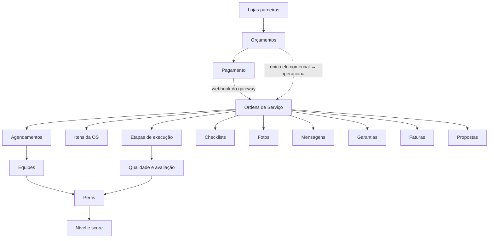
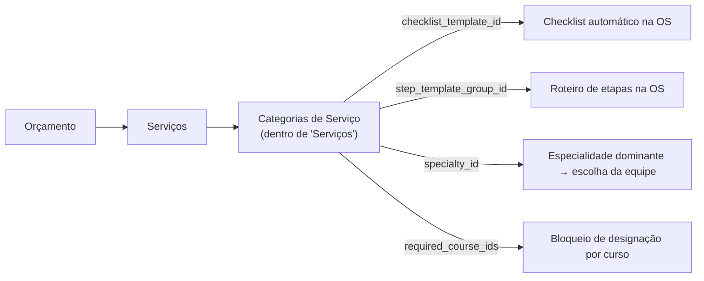
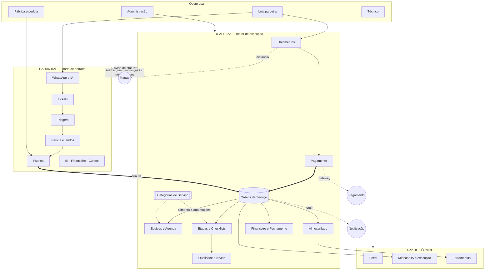

# Auditoria da Arquitetura Funcional — Ecossistema Reallliza

**Data:** 14 de agosto de 2026
**Escopo:** Reallliza (plataforma de execução) em profundidade; Garantias (porta de entrada) em inventário; e a fronteira entre os dois.
**Propósito:** servir de base factual para a reorganização da árvore de menus, sem quebrar regra, automação ou funcionalidade existente.

---

## Sumário executivo

O ecossistema são **dois sistemas independentes**, com bancos separados, papéis diferentes e uma integração de mão única entre eles:

| | Garantias | Reallliza |
|---|---|---|
| Papel | Porta de entrada: WhatsApp, tickets, triagem, perícia, fábrica | Motor de execução: orçamento, OS, equipes, agenda, almoxarifado, financeiro |
| Superfícies | 1 painel web + portal da loja | 1 painel web + app do técnico |
| Rotas de API | 110 | 203 (278 handlers) |
| Páginas | 48 | 62 + 22 telas mobile |
| Papéis de usuário | 10 declarados, **4 em uso** (admin, periciador, fábrica, operador) | 3, todos em uso |
| Itens de menu | 28 (4 saltam para o Reallliza) | 38 declarados |

**Cinco conclusões que devem guiar a reorganização:**

1. **`service_orders` é o eixo de tudo.** Mais de 20 tabelas apontam para ela. Qualquer agrupamento de menu que separe o que gira em torno da OS vai separar coisas que os usuários usam juntas.

2. **`service_categories` é o segundo ponto mais crítico do sistema e está escondido dentro de "Serviços".** Quatro automações leem dela — checklist automático, template de etapas, especialidade dominante e bloqueio por curso obrigatório. Ela parece um cadastro auxiliar e é infraestrutura.

3. **Permissão não vive na navegação.** Todas as rotas de API usam credencial administrativa e checam papel no próprio código; o controle no banco (RLS) só vale para o acesso direto do aplicativo. Reorganizar menu não muda quem pode o quê.

4. **Há três entradas para o mesmo eixo de avaliação** (Avaliações, Níveis e Avaliação, Qualidade) e três recortes da mesma lista de OS (Ordens de Serviço, Aguardando Designação, OSs Homologados). São os candidatos mais claros a agrupamento.

5. **Oito módulos têm zero registros em produção.** Isso mede adoção, não utilidade — e a distinção é importante para não remover o que ainda não foi usado.

---

## Método

Os números deste documento não vêm de leitura de código. Cada afirmação foi verificada assim:

- **Árvore de menus:** lida diretamente do array de navegação de cada sistema.
- **Páginas:** listagem de todos os arquivos de página, comparada item a item com a árvore.
- **Dependências e automações:** rastreadas do ponto de chamada até a tabela afetada.
- **Uso real:** contagem de registros executada na base de produção em 14/08/2026.

Onde não foi possível determinar algo, está escrito "não determinado" em vez de uma suposição.

---

## 1. Auditoria Funcional

Organizada por domínio de negócio, não pela ordem do menu — a ordem atual é justamente o que está em questão.

### 1.1 Comercial (loja parceira)

| Funcionalidade | Objetivo | Quem usa | Processa | Fluxo |
|---|---|---|---|---|
| **Orçamentos** | Montar orçamento a partir do catálogo, com preço calculado automaticamente | Loja, Admin | Cria orçamento e itens; calcula deslocamento, estadia, hora especial e taxa da plataforma | Comercial → Execução |
| **Clientes** | Consultar clientes atendidos | Loja | Só leitura — a lista é derivada dos orçamentos, não há cadastro próprio | Apoio |
| **Propostas** | Publicar serviço para a rede homologada | Admin | Cria proposta direta ou aberta por estado | Comercial → Execução |
| **Relatórios (loja)** | Acompanhar as OS da própria loja | Loja | Só leitura | Acompanhamento |
| **Financeiro (loja)** | Ver pagamentos da loja | Loja | Só leitura | Acompanhamento |
| **Garantias** | Abrir garantia sobre serviço concluído | Loja, Admin | Cria garantia e roteia automaticamente ao executor original | Pós-venda |

### 1.2 Execução

| Funcionalidade | Objetivo | Quem usa | Processa | Fluxo |
|---|---|---|---|---|
| **Ordens de Serviço** | Lista e operação das OS | Admin, Técnico | Cria, edita, muda status, cancela, gera retrabalho | Núcleo |
| **Aguardando Designação** | Fila de OS sem equipe | Admin | Designa equipe ou técnico | Núcleo |
| **OSs Homologados** | Acompanhar o que a rede externa executa | Admin | Só leitura | Núcleo |
| **Agenda** | Calendário de agendamentos | Admin, Técnico | Cria e edita agendamento | Núcleo |
| **Equipes** | Compor equipes e ver disponibilidade | Admin | Cria equipe, adiciona e remove membros | Apoio à execução |
| **Mapa** | Localização dos técnicos em rota | Admin | Só leitura | Acompanhamento |
| **Chats** | Conversa por OS | Admin | Envia mensagem, que é repassada ao Garantias | Comunicação |
| **Checklists** | Conferência de itens na execução | Admin, Técnico | Instancia de template e marca itens | Etapa |
| **Templates de Execução** | Definir o roteiro de etapas | Admin | Cria grupos de etapas com foto mínima, ocorrência e tempo de espera | Configuração |

### 1.3 Almoxarifado

Nove áreas dentro de um módulo único, com navegação própria: Dashboard, Catálogo, Inventário, Pedidos, Custódias, Devoluções, Manutenção, Baixas e Pesquisa.

| Funcionalidade | Objetivo | Processa |
|---|---|---|
| **Catálogo** | Cadastrar o *tipo* de ferramenta e o modo de controle (por unidade ou por quantidade) | Cria e edita tipo |
| **Inventário** | Cadastrar a *peça física*, com código, patrimônio e série | Cria e edita unidade |
| **Pedidos** | Fila de solicitações do técnico | Aprova, separa, entrega, recusa |
| **Custódias** | Quem está com o quê | Registra entrega, devolução, dano, prorrogação |
| **Devoluções / Manutenção / Baixas** | Recebimento, conserto e aposentadoria | Muda estado da unidade e registra evento |

O histórico de cada ferramenta é **permanente e não editável**: correções entram como evento novo, nunca sobrescrevem.

### 1.4 Cadastros e configuração

Serviços, Categorias de Serviço, Especialidades, Regiões, Usuários, Parceiros, Homologação, Configurações Globais (empresa, estadia por estado, feriados, cobertura), Níveis e Avaliação.

### 1.5 Gestão

Dashboard, BI, Relatórios, Financeiro, Fechamento Mensal, Qualidade, Avaliações, Auditoria.

### 1.6 Conteúdo e capacitação

Feed, Cursos (gestão), Aprendizado (aluno), Notificações.

---

## 2. Inventário de Funcionalidades

O campo **Status** tem três eixos separados de propósito. Juntos, escondem o que importa: "Cursos" e "Chats" pareceriam iguais, quando o primeiro funciona e ninguém usou, e o segundo está quebrado.

- **Menu** — alcançável pela navegação
- **Uso** — registros em produção (14/08/2026)
- **Estado** — defeito conhecido, quando houver

### Reallliza — itens de menu

| # | Item | Tipo | Menu | Uso | Estado |
|---|---|---|---|---|---|
| 1 | Dashboard | Painel | ✅ todos | — | ok |
| 2 | Feed | Módulo | ✅ todos | **0 publicações** | ok, sem uso |
| 3 | Ordens de Serviço | Módulo | ✅ admin, técnico | 41 OS | ok |
| 4 | Aguardando Designação | Processo | ✅ admin | 12 OS nesse estado | ⚠️ estado sem saída pelo fluxo normal |
| 5 | OSs Homologados | Relatório | ✅ admin | — | ok |
| 6 | Orçamentos | Módulo | ✅ admin, loja | 47 orçamentos | ok |
| 7 | **Solicitações** | Módulo | ❌ **nenhum papel** | — | ⚠️ **item morto**, página viva |
| 8 | Clientes | Consulta | ✅ loja | derivado | ok |
| 9 | Propostas | Processo | ✅ admin | 3 propostas | ok |
| 10 | Garantias | Módulo | ✅ todos | **0** | ok, sem uso |
| 11 | Relatórios (loja) | Relatório | ✅ loja | — | ok |
| 12 | Financeiro (loja) | Relatório | ✅ loja | — | ok |
| 13 | Chats | Módulo | ✅ admin | — | ❌ **quebrado**: a lista de conversas chama rota inexistente |
| 14 | Agenda | Módulo | ✅ admin, técnico | 37 agendamentos | ok |
| 15 | Mapa | Consulta | ✅ admin | — | ok |
| 16 | Usuários | Cadastro | ✅ admin | 25 perfis | ok |
| 17 | Parceiros | Cadastro | ✅ admin | 5 lojas | ok |
| 18 | Equipes | Cadastro | ✅ admin | 4 equipes, 3 membros | ok |
| 19 | Homologação | Processo | ✅ admin | **0 solicitações** | ok, sem uso |
| 20 | Ferramentas | Módulo (9 áreas) | ✅ admin, técnico | 9 tipos, 19 pedidos, 6 custódias | ok |
| 21 | Checklists | Módulo | ✅ admin, técnico | 2 | ok |
| 22 | Templates de Execução | Configuração | ✅ admin | 2 grupos | ok |
| 23 | Serviços | Cadastro | ✅ admin | 11 serviços, 9 categorias | ok — **ver 4.2** |
| 24 | Regiões | Cadastro | ✅ admin | **0** | ok, sem uso |
| 25 | Especialidades | Cadastro | ✅ admin | 10 | ok |
| 26 | Qualidade | Processo | ✅ admin | **0** | ok, sem uso |
| 27 | Níveis e Avaliação | Configuração | ✅ admin | config | ⚠️ critério de certificação nunca pontua |
| 28 | Avaliações | Processo | ✅ admin | 5 | ok |
| 29 | Relatórios | Relatório | ✅ admin | — | ok |
| 30 | Financeiro | Módulo | ✅ admin | 53 pagamentos, 1 fatura | ok |
| 31 | BI / Dashboards | Relatório | ✅ admin | — | ok |
| 32 | Fechamento Mensal | Processo | ✅ admin | 1 | ok |
| 33 | Config. Globais | Configuração | ✅ admin | — | ok |
| 34 | Cursos | Módulo | ✅ admin | **0 cursos, 0 matrículas** | ok, sem uso |
| 35 | Aprendizado | Módulo | ✅ técnico | **0** | ok, sem uso |
| 36 | Auditoria | Relatório | ✅ admin | 841 registros | ok |
| 37 | Notificações | Módulo | ✅ todos | 291 | ⚠️ **push nunca entregou** — ver 4.4 |
| 38 | Configurações | Perfil | ✅ todos | — | ok |

### Páginas fora do menu

Das 62 páginas, 24 não têm item próprio de menu. Elas se dividem em três naturezas — e só uma é problema:

| Natureza | Quantas | Exemplos | Avaliação |
|---|---|---|---|
| Sub-navegação do módulo Ferramentas | 9 | Catálogo, Inventário, Pedidos… | Correto: têm navegação própria dentro do módulo |
| Telas públicas fora do painel | 5 | Login, recuperar senha, cadastro profissional, rastreamento por link | Correto por natureza |
| Detalhe e criação, alcançadas por link | 9 | Nova OS, detalhe da OS, novo orçamento, calendário da equipe | Correto: são destino de clique, não de menu |
| **Página sem porta de entrada** | 1 | `/solicitacoes` | ⚠️ **problema** — o item existe no menu com zero papéis |

---

## 3. Árvore Atual

São **três** superfícies de navegação, não uma.

### 3.1 Reallliza — painel web

```
Dashboard
Feed
Ordens de Serviço ─┬─ Aguardando Designação
                   └─ OSs Homologados
Orçamentos
Solicitações  (invisível — zero papéis)
Clientes · Propostas · Garantias
Relatórios (loja) · Financeiro (loja)
Chats · Agenda · Mapa
Usuários · Parceiros · Equipes · Homologação
Ferramentas ─┬─ Dashboard · Catálogo · Inventário · Pedidos
             ├─ Custódias · Devoluções · Manutenção
             └─ Baixas · Pesquisa
Checklists · Templates de Execução
Serviços · Regiões · Especialidades
Qualidade · Níveis e Avaliação · Avaliações
Relatórios · Financeiro · BI · Fechamento Mensal
Config. Globais · Cursos · Aprendizado
Auditoria · Notificações · Configurações
```

Dos 38 itens declarados, por papel: **admin** 33 · **técnico** 10 · **loja** 9 · **nenhum papel** 1 (Solicitações).

### 3.2 Garantias — painel web

```
Dashboard
Tickets · Chats · Triagem · Suporte Operacional
IA & Integrações
Perícia & Laudos · Fábrica · Logística & OS
→ Ordens de Serviço      (abre o Reallliza)
Agenda
→ Ferramentas            (abre o Reallliza)
→ Serviços               (abre o Reallliza)
Feed Corporativo · Aprendizado · Cursos · Meus Cursos
Avaliações · Financeiro · BI & Relatórios
Segurança · Configurações
Usuários · Permissões · Roteiros da IA · Técnicos · Lojas Parceiras
→ Homologação            (abre o Reallliza)
```

Mais um **portal separado da loja** (`/loja`), que não usa esta navegação: Início, Serviços, Orçamentos.

Os quatro itens com seta abrem o Reallliza em outra aba. A decisão está registrada no próprio código: os módulos existem completos lá e pela metade aqui, e manter duas versões concorrentes fazia o cliente testar a errada.

### 3.3 App do técnico

Abas: **Início** (Feed) · Serviços (OS) · Perícias · Aprendizado · Propostas · Agenda · Ferramentas · Notificações.

Vale notar: **Perícias existe no app e no Garantias, mas não no painel do Reallliza.**

---

## 4. Mapa de Dependências

### 4.1 O eixo



**Leitura:** mais de 20 tabelas apontam para Ordens de Serviço. E existe **um único elo** entre o mundo comercial e o operacional — o campo que liga o orçamento à OS gerada. Todo o resto do fluxo pende desse vínculo.

### 4.2 O hub escondido



Quatro automações distintas leem dessa tabela. Ela é alcançada pelo menu como uma aba dentro de "Serviços" e não tem item próprio. **Mexer nela afeta a conversão de orçamento, a mudança de status, a designação e o bloqueio por curso — quatro caminhos que ninguém associa a um cadastro de catálogo.**

### 4.3 Automações

| Automação | O que dispara | O que acontece |
|---|---|---|
| **Conversão de orçamento em OS** | Três entradas: webhook do gateway, pagamento sem gateway, confirmação manual | Cria a OS, copia itens, escolhe equipe, agenda os dias, valida cursos, notifica, e publica para a rede se for homologados |
| **Escolha automática de equipe** | Conversão | Especialidade dominante por peso de horas → equipes qualificadas → primeira janela de dias contíguos livres |
| **Agendamento contíguo** | Conversão | Jornadas de 8h em dias seguidos; pula feriado sempre e fim de semana salvo autorização; evita dia já ocupado pela equipe |
| **Automação por categoria** | Três pontos: mudança de status, designação manual, conversão | Cria checklist e roteiro de etapas conforme a categoria dos itens |
| **Bloqueio por curso obrigatório** | Designação | Sem membro habilitado, a OS volta para a fila sem equipe |
| **Publicação para homologados** | Conversão, e reajuste de valor pela loja | Cria proposta aberta por estado e avisa os homologados daquela região; o primeiro que aceitar leva |
| **Recálculo de nota e nível** | OS concluída ou cancelada, retrabalho, avaliação do cliente | Combina três fontes com pesos configuráveis e reposiciona o profissional no nível |
| **Custódia e repasse** | Pagamento de serviço da rede externa | Retém o valor até a conclusão; libera com transferência ao executor |
| **Roteamento de garantia** | Abertura de garantia | Identifica se o executor era interno ou externo e direciona |
| **Retentativa de integração** | Tarefa a cada 5 minutos | Reenvia avisos ao Garantias que falharam, com espera crescente |

**Este é o único processo automático por tempo em todo o sistema.**

### 4.4 O que quebra se mexer

| Se mudar | Impacto |
|---|---|
| Categorias de Serviço | Quatro automações; checklist e etapas param de aparecer sozinhos |
| A conversão de orçamento | Três caminhos de pagamento de uma vez |
| Papéis e permissões | Nada muda na navegação — o controle está no código de cada rota |
| A rota de designação | É o **único** caminho para tirar uma OS da fila de "Aguardando Designação" |
| Estrutura de menu | Não afeta permissão, automação nem integração — é seguro reorganizar |

**A última linha é a resposta direta à pergunta da Jéssica:** reorganizar a árvore de menus é seguro. O que não é seguro é mexer nos cadastros que parecem auxiliares e são infraestrutura.

### 4.5 Integrações

| Integração | Para quê | Se cair |
|---|---|---|
| Gateway de pagamento | Cobrança, confirmação e repasse | Sem chave, o sistema confirma na hora e converte — o fluxo não trava |
| Nota fiscal | Emissão e cancelamento | Fica pendente para emissão manual |
| Mapas | Distância e coordenadas | Cai para cálculo em linha reta e centro do estado |
| Notificação push | Aviso no celular | **Hoje não entrega a ninguém** — nenhum aparelho registrado. A causa é o registro rodar antes do login e não repetir depois |
| Armazenamento | Fotos, anexos, documentos | — |
| Tempo real | App recebe mudança de OS na hora | — |
| Garantias | Cria OS por três caminhos e sincroniza mensagens, avaliações, feed e cursos | Fila de retentativa |

---

## 5. Fluxos Operacionais

### 5.1 Do orçamento à conclusão


Os blocos em destaque acontecem sem intervenção humana. **Da confirmação do pagamento até a OS agendada com roteiro de execução, ninguém toca no sistema.**

Se não houver equipe com a sequência de dias livre, a OS cai em "Aguardando Designação" e espera um administrador.

### 5.2 Da garantia à execução (atravessa os dois sistemas)


### 5.3 Rede homologada


### 5.4 Ferramenta

```
Técnico pede → Almoxarife aprova → Separa unidades → Entrega
   → Custódia aberta → Devolução solicitada → Conferência → Custódia fechada
```
Cada passo grava um evento permanente na ficha da ferramenta.

### 5.5 Entrada de profissional

```
Cadastro público → Homologação → Especialidades → Nota e nível → Elegível a receber OS
```

---

## 6. Diagrama Geral da Arquitetura



**Como ler:** o Garantias captura e decide; o Reallliza executa. A seta grossa da fábrica para OS e a do pagamento para OS são as duas formas de uma ordem de serviço nascer. O bloco pontilhado de Categorias de Serviço é o hub escondido — ele não aparece na navegação com esse peso, mas alimenta quatro automações.

---

## 7. Achados

### 7.1 Defeitos

| Gravidade | Onde | O quê |
|---|---|---|
| **Alto** | Notificação push | Nenhum aparelho registrado. O registro roda na abertura do app, antes do login, e a rota exige autenticação — falha e não repete. Todas as notificações de OS e agenda nunca chegaram ao celular |
| **Alto** | Chats | A lista de conversas chama uma rota que não existe. A tela quebra ao abrir |
| **Médio** | Aguardando Designação | O estado não consta no mapa de transições. As 12 OS nesse estado só saem pela tela de designação; qualquer outra tentativa é recusada |
| **Médio** | Anonimização (LGPD) | A rotina não cobre curtidas e comentários do feed. Dados pessoais permanecem após o pedido de anonimização |
| **Baixo** | Menu | "Solicitações" está declarado com zero papéis — invisível a todos, com a página ainda no sistema |
| **Baixo** | Menu | Existe um trecho que renomeia "Ordens de Serviço" para "Meus Chamados" na visão da loja, que nunca executa porque a loja não vê esse item |
| **Baixo** | Níveis | O critério de certificação está fixado em zero no cálculo — existe na configuração e nunca pontua |
| **Baixo** | Almoxarifado | Existe um tipo de aviso para ferramenta em atraso, mas nada o dispara |

### 7.2 Redundâncias

**Dentro do Reallliza**
- Três entradas para o mesmo eixo de avaliação: **Avaliações**, **Níveis e Avaliação**, **Qualidade**
- Três recortes da mesma lista: **Ordens de Serviço**, **Aguardando Designação**, **OSs Homologados**
- Três telas sobre a mesma entidade de orçamento: **Orçamentos**, **Solicitações**, **Garantias**
- Dois itens chamados "Relatórios" e dois chamados "Financeiro" (não colidem porque os papéis são disjuntos, mas o rótulo é ambíguo em documentação e suporte)
- **Configurações** e **Config. Globais** — a diferença não é óbvia pelo nome

**Entre os dois sistemas**
- OS, Ferramentas, Serviços e Homologação existem nos dois; o Garantias já resolve com atalho externo, mas as páginas locais concorrentes continuam no sistema
- Cursos e Aprendizado existem completos nos dois
- Feed existe nos dois, sobre a mesma tabela, sincronizada por integração
- Duas telas públicas distintas de avaliação por link no Garantias, com geradores diferentes

### 7.3 Uso real (14/08/2026)

| Com uso | Sem nenhum registro |
|---|---|
| Auditoria (841) · Notificações (291) · Pagamentos (53) · Orçamentos (47) · OS (41) · Agendamentos (37) · Pedidos de ferramenta (19) · Serviços (11) · Especialidades (10) | Regiões · Cursos · Matrículas · Qualidade · Contas a pagar e receber · Feed · Homologação · Garantias |

No Garantias: 14 tickets, 8 laudos, 7 perfis, 1 organização.

**Interpretação:** a plataforma está em fase inicial de operação real. Os módulos sem registro não são inúteis — a maioria nunca entrou em uso. A reorganização pode agrupá-los ou recolhê-los para segundo plano, mas removê-los seria decidir pelo dado errado.

---

## Anexo — como reproduzir os números

- **Itens de menu:** array de navegação em `web/src/app/(dashboard)/layout.tsx` e `frontend/src/components/layout/sidebar.tsx`
- **Páginas:** listagem de arquivos `page.tsx` sob `src/app`
- **Rotas de API:** listagem de arquivos `route.ts` sob `src/app/api`
- **Uso:** contagem de registros por tabela na base de produção de cada sistema
- **Automações:** rastreadas a partir de `web/src/lib/quotes/convert-to-os.ts`, `web/src/lib/service-orders/category-automation.ts`, `web/src/app/api/service-orders/[id]/status/route.ts` e `web/src/lib/quotes/fanout-homologados.ts`
